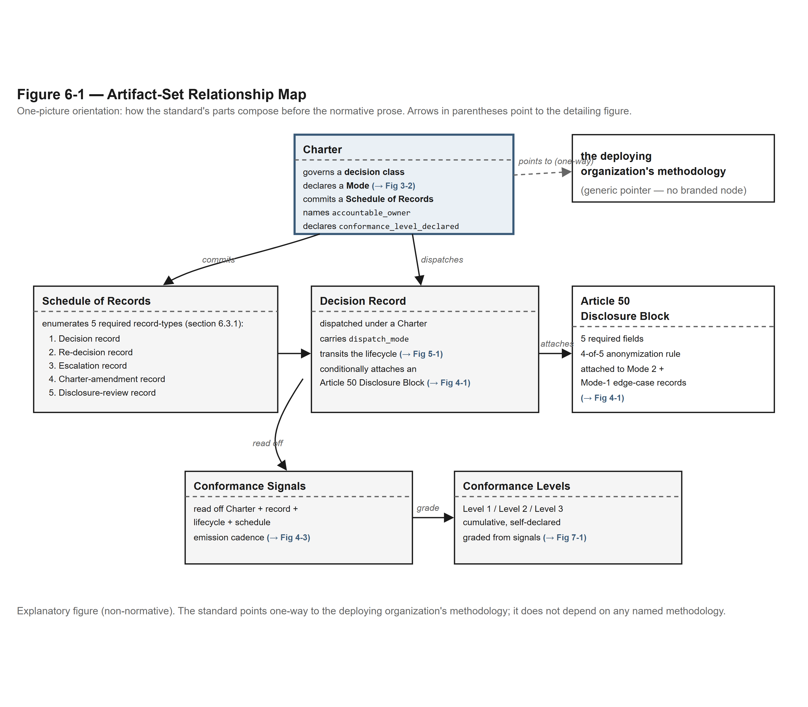
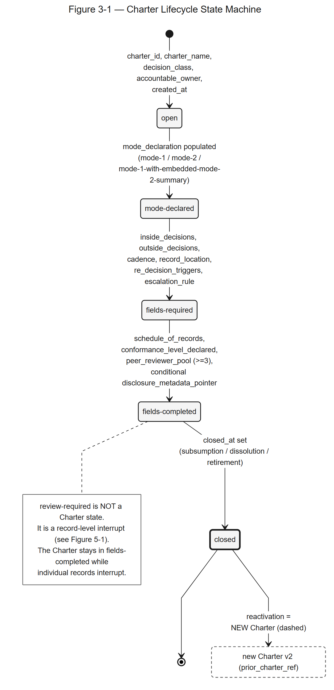

# Section 3 — The Charter Mechanism

> **Disclaimer pointer.** The "Use of the Standard" notice and the Jurisdiction Assumed declaration governing this Section live at the top of the Decision Provenance Standard™. Readers arriving at this Section directly should read Section 1 first; the artifact-scoped notice is load-bearing for everything that follows.

---

## 3.1 Purpose of the Charter Mechanism

The Charter is the structural unit at the foundation of the Decision Provenance Standard™. A Charter binds an organization to a decision-making mechanism for a recurring decision class — a class of decisions that arise on a cadence (launch readiness, pricing exceptions, platform intake, portfolio stop-continue calls, partnership architecture, customer-outcome reads, and so on) rather than as one-off events. Where the Standard's other sections describe how a single decision's record progresses to sealed status (Section 5), what fields the record carries (Section 6), how authority and authorship are assigned to a single decision (Section 4), and what conformance level a Charter or decision record reaches (Section 7), this Section describes the artifact that makes a recurring decision class governable in the first place. How these artifacts compose is illustrated by the orientation map in **Figure 6-1** (see **Companion D**).

*Figure 6-1 — Artifact-Set Relationship Map. Explanatory, non-normative. (Full text-alternative: Companion D.)*

The Charter mechanism exists because an organization that does not bind its recurring decisions to a named mechanism lets authorship, dispatch mode, and record location drift. That drift stays invisible until counsel or an auditor asks where a particular decision was made. The answer then requires reconstruction from email threads, calendar invitations, and the memories of people who happened to be in the room. The Charter prevents that reconstruction. It commits, in writing and before decisions begin to dispatch under it, to a named accountable owner, a declared dispatch mode, a schedule of records, and a set of triggers that reopen the decision class when the conditions the Charter assumed have changed.

Section 3 is the architectural backbone of the Standard. Sections 4, 5, 6, 7, and 9 all rest on the Charter mechanism this Section establishes. Section 4 describes how authority and authorship are assigned to decisions made under a Charter; the Charter is the substrate Section 4 binds against. Section 5 describes the lifecycle states a record produced under the Charter transits; the Charter authorizes the lifecycle. Section 6 describes the schedule of records a Charter commits to maintain; the schedule is a Charter field. Section 7 grades conformance levels at the Charter and decision-record altitude; the Charter is the unit of grading. Section 9 presents worked examples of Charters across functional surfaces; the examples are instances of the mechanism Section 3 codifies.

The Charter is the Standard's own structural mechanism: a binding artifact whose required fields, lifecycle states, and binding properties this Section fixes so that conformance can be assessed. Where a Charter is the signature artifact of the decision system a deploying organization installs and runs, this Section makes its required fields, lifecycle states, and binding properties normative.

**Charter cadence calibration by altitude.** A Charter's cadence is calibrated to the altitude at which the Charter operates. That cadence covers three things: the rate at which the recurring decision class fires, the cadence at which review and affirmation events occur, and the cadence at which re-decision triggers are evaluated. Executive-altitude Charters (CEO, CPO, CFO, CIO, CHRO, GC, board-oversight) operate on quarterly to annual cadences. Function-leader-altitude Charters (Directors of Product, Engineering, Design, Product Operations, Product Marketing, and equivalents) operate on monthly to quarterly cadences. Team-leader and individual-professional altitude Charters operate on faster cadences appropriate to their decision class. The Standard does not specify a single cadence. The Charter's cadence is declared per Charter and is consumed by the §6.4 discoverability and retention discipline. A Charter that mismatches its cadence to its altitude (an executive Charter with weekly cadence; an IC-altitude Charter with annual cadence) is a Charter whose accountable owner has misread the altitude. The Charter mechanism is silent on the mismatch, but the deployer's decision-quality work product surfaces it.

**Works-council cadence vs Charter cadence — independent clocks.** Where the Charter operates in a works-council jurisdiction per Appendix G §G.11.3 paragraph 4, the works-council consultation cadence and the Charter cadence are independent clocks. The Charter's altitude-calibrated cadence governs the rate at which the recurring decision class fires, the cadence at which review and affirmation events occur, and the cadence at which re-decision triggers are evaluated; the works-council consultation cadence follows whatever timelines apply to the deployer (the regimes listed in Appendix G §G.11.3 paragraph 4). The Charter advances at the slower of the two clocks: where the works-council consultation cadence is longer than the Charter's altitude-calibrated cadence, the Charter's `fields-completed` advance and any subsequent material amendment to the dispatch class SHALL await consultation completion per the named regime; where the Charter's altitude-calibrated cadence is longer, the consultation cadence is not accelerated by the Charter. The Standard does not adjudicate which clock is slower in any given installation; that is for the deployer to determine (Appendix G §G.11.3 lists the regimes; the Charter records the outcome in its `works_council_consultation_record` sub-field below).

**Charter use-case scope-limit declaration.** A Charter that creates records describing natural persons (the Charter's `accountable_owner`, the Charter's named human reviewers, and — at lower altitudes per Appendix G §G.11.3 — the affirmers and named participants in the underlying decisions) declares the use cases for which records under the Charter are in scope. The use-case scope-limit declaration is a required field at the Charter's `fields-completed` lifecycle state (per §3.3) where any record under the Charter would describe a natural person below executive altitude. The declaration's enumerated scope MUST be one of the values defined here; free-text or hybrid scopes are not conformant.

**Default-permitted scopes — exhaustive enumeration.** A Charter MAY default-permit, without additional declaration, only: (i) `audit-readiness` — records used as input to the deployer's internal audit, regulatory-readiness, or external-auditor work; (ii) `internal-optimization` — records used as input to process-improvement, decision-quality, or operational-cadence work, aggregated above the individual-professional altitude before any consumption decision. `team-level-measurement` is default-permitted only at `altitude: team-leader` and above, and only where individual contributions are not derivable from the team-level record without re-authoring.

**`individual-development-coaching` — explicitly conditional, not default.** This scope is permitted at `altitude: individual-professional` only where ALL three Charter sub-fields below are populated and verifiable by the access-policy layer at Charter advance per §6.2.3.1: (a) `affirmer_consent.coaching_consent_record_pointer` — a pointer to the data subject's separately-obtained, revocable, use-case-scoped consent recorded as a record-field per Appendix G §G.11.3; the consent record MUST name `individual-development-coaching` as the in-scope use case and MUST NOT be bundled with any offer letter, employment-handbook acknowledgment, or general data-processing notice; (b) `excluded_downstream_uses` — an explicit declared set listing, at minimum, `performance-management`, `compensation-calibration`, `retention-decision`, `termination-decision`, and `disciplinary-action` as out-of-scope; the access-policy layer SHALL reject any read principal whose role under the deployer's IAM resolves to a function whose primary purpose is one of the excluded uses; (c) `hr_of_record_charter_scope_confirmation` — written confirmation by the deployer's HR-of-record (per Appendix G §G.11.3) that the Charter's scope is bounded to coaching and that no operational pathway exists by which records under this Charter become inputs to performance-management, compensation, retention, or termination decisions; the confirmation is itself an affirmed record at `altitude: function-leader`. A Charter that omits any of the three sub-fields SHALL NOT advance to `fields-completed` with `individual-development-coaching` enumerated; records dispatched under such a Charter are non-conformant.

**Scope expansion — separate Charter required.** A deployer that wishes to use records authored under an `individual-development-coaching` Charter as input to performance management, compensation calibration, retention decisions, termination decisions, disciplinary action, or any decision class outside the original Charter's enumerated scope SHALL author a NEW Charter under §3 with the new use-case scope-limit declaration explicitly populated. The new Charter SHALL: (i) name the deployer's employment counsel of record per Appendix G §G.11.3; (ii) complete works-council pre-consultation per Appendix G §G.11.3 paragraph 4 where the local regime requires it; (iii) obtain explicit, separately-recorded re-consent from each affirmer whose prior records would be consumed under the new scope; (iv) populate a fresh `excluded_downstream_uses` set. Records authored under the prior Charter are sealed at their prior `seal_hash` per §5.1(3) and are not retroactively re-scoped; the new Charter governs records authored under it from `fields-completed` forward only.

The Standard does not authorize, validate, or recommend any scope expansion beyond what the Charter explicitly enumerates. The Charter is the operational surface where the deployer determines which use cases are in scope at which altitudes, with whatever HR, legal and works-council review it has; §6.2.3.1 is where that governance becomes architecturally enforced rather than policy-asserted.

*"Where the Charter authorizes records at function-leader altitude or below in EU/UK jurisdictions with works-council co-determination or consultation regimes, the deployer SHALL complete works-council pre-consultation per Appendix G §G.11.3 before the Charter advances past `fields-completed` to operational dispatch."*

**Works-council consultation record — Charter sub-field.** Where a Charter under this Section operates in a jurisdiction listed in Appendix G §G.11.3 paragraph 4 (German Betriebsverfassungsgesetz §87, French Code du travail Article L. 2312-26, Dutch Wet op de ondernemingsraden, or analogous EU/UK consultation or co-determination regime) and authorizes records at `altitude: function-leader` or below, the Charter SHALL carry the `works_council_consultation_record` field at the Charter's `fields-completed` lifecycle state per §3.3 and §6.2.3. The field records: the consultation jurisdiction (enum: `de-betriebsrat` / `fr-cse` / `nl-or` / `eu-uk-other-with-free-text`); the council's identity (council name + legal seat per the named regime); the consultation completion date (which SHALL be on or before the Charter's `fields-completed` date); the outcome class (enum: `agreement-reached` / `consultation-completed-without-agreement` / `consultation-completed-with-conditions` / `consultation-pending-with-good-faith-progress`); and, where `outcome_class` is `agreement-reached` or `consultation-completed-with-conditions`, a pointer to the deployer's HR-of-record-maintained outcome document. Where the deployer selects `eu-uk-other-with-free-text`, the free-text statement SHALL name a specific consultation or co-determination regime by statute, code section, or analogous statutory citation; the Standard does not adjudicate whether the named regime is the correct regime for the deployer's installation; that is for the deployer to determine. Free-text entries that do not name a specific consultation or co-determination regime SHALL be rejected by the access-policy layer at Charter advance. Whether the deployer's selected outcome class is correct under the named regime is for the deployer to determine; the Standard records the deployer's selection and binds the access-policy layer per §6.2.3.1 to enforce the deployer's local-regime determination. Where the `outcome_class` is `consultation-completed-without-agreement`, the deployer determines whether the Charter advances and at what altitude; the Standard records the outcome class and does not authorize Charter advancement on a `without-agreement` outcome. Whether the Charter may advance without agreement is for the deployer to determine; the Standard gives no permission to do so. The works-council consultation outcome is co-determinative with the Charter's `use_case_scope_limit_declaration` (§3.1): where the outcome is `consultation-completed-with-conditions`, the use-case scope-limit declaration SHALL reflect those conditions. Where a Charter is populated post-advance with this field — for example, where the deployer in good faith discovers a missed consultation, completes it, and back-fills — the post-advance population is recorded in the Charter's `revision_history` per §6.2.3, and the Charter SHALL self-declare at Conformance Level 1 only until re-authored under §11.2 versioning with the consultation record populated at `fields-completed` of the new version. The original Charter version is retained in full per §5.1(3). The Standard's records inform the deployer's pre-consultation work; they do not satisfy any consultation obligation. Whether one applies, and who carries it, is for the deployer to determine.

### What the Charter is not

Three explicit non-claims govern this Section.

A Charter is **not a contract**. Contract law fixes obligations between parties through offer, acceptance, consideration, and the doctrines of contract formation; a Charter does none of those things. A Charter is an internal organizational artifact that binds the organization to a decision-making mechanism. It does not create rights or obligations that a counterparty could enforce in court, and the Standard does not opine on whether any clause of a Charter could be construed as contractually binding under any jurisdiction. Deployers seeking contractual force for any commitment a Charter describes must contract for that force separately; the Charter is not the instrument.

A Charter is **not a regulatory filing**. No regulator certifies, accepts, or recognizes a Charter as discharging a regulatory obligation. The Charter mechanism is published under CC-BY 4.0 as an open standard; it is not a certification track, and no regulatory body has signed off on it. Where a Charter under this Standard touches a regulated decision class — Mode 2 dispatches where EU AI Act Article 50 disclosure may apply, board-oversight decisions touching Caremark-line duties, decisions implicating SOX 404 internal controls — whether any regulatory obligation applies, and who carries it, is for the deployer to determine, and the Charter structures inputs rather than discharging any obligation.

A Charter is **not a certification**. No third-party certifying body certifies a Charter against the Standard. Section 7 (Conformance Levels) defines named tiers — Level 1, Level 2, Level 3 — at which a Charter's structural requirements are met, and a deployer's conformance-level reporter declares the level the Charter has reached. The declaration is a structured fact about field population and structural completeness; it is not a certification, and no field on a Charter authorizes the use of the word "certified" in connection with the Charter or any decision record produced under it. **Conformance Levels are self-declared by the adopting organization** (per §7 lead and Appendix G §G.11.3 voluntary-adoption discipline).

The Charter binds the **organization** to a **decision-making mechanism**. It does not bind individuals to obligations beyond those the individuals' role definitions, employment agreements, or fiduciary duties already create. Where a Charter names an `accountable_owner`, the naming records that the organization has assigned accountability for the Charter to a single named human; the obligations that human carries to the organization remain governed by the human's role definition and the organization's policies. The Charter records the assignment; it does not create the underlying obligation.

This non-claim is structurally important. A Charter that drifted into "creates an obligation on the executive" or "binds the executive to oversight" language would be reaching for legal force the artifact does not carry, and would expose the deployer to claims that the Charter substitutes for or alters the underlying role obligations. The corrected formulation, used throughout this Section, is that the Charter **binds the organization to a decision-making mechanism**.

---

## 3.2 Charter Required Fields

A Charter under this Standard is a structured artifact carrying the fields enumerated below. Field names are the binding identifiers; serializations may be JSON, YAML, typed objects, or human-readable prose so long as the field semantics align with the definitions in this subsection. Where a deployer's existing artifact set carries an analogous field under a different name, the Standard does not require renaming, but the deployer's conformance-level reporter (Section 7) must map the existing field to the binding identifier this Subsection defines.

The required-at-state column declares the lifecycle state at which the field becomes required. Lifecycle states are defined in §3.3.

| Field | Required at state | Definition |
|---|---|---|
| `charter_id` | `open` | A stable identifier for the Charter that survives ownership changes, renames, and amendments. The identifier is a slug or comparable durable token; it is not the human-readable name. |
| `charter_name` | `open` | The human-readable name of the Charter (e.g., "Product Marketing Decision Interface Charter," "Launch Readiness Charter"). |
| `decision_class` | `open` | The recurring decision class the Charter governs (e.g., "positioning lock before build-lock," "platform intake prioritization," "quarterly portfolio stop-continue"). The Charter governs decisions of this class and does not authorize dispatches outside it. |
| `accountable_owner` | `open` | A single named human accountable for the Charter. One and only one. The accountable owner is a person, not a role, a team, an agent, or an organizational unit. Where role-based language is appropriate in deployer-facing surfaces, the Charter must still record a person's name in this field. |
| `inside_decisions` | `mode-declared` | The list of decisions made inside this Charter's interface — what the Charter explicitly governs. The Inside / Outside pairing is the Standard's mechanism for giving a Charter a defensible boundary. |
| `outside_decisions` | `mode-declared` | The list of decisions explicitly pushed back from this interface — what the Charter does not govern. The pairing of `inside_decisions` and `outside_decisions` is what gives the Charter a defensible boundary; an unbounded Charter is a Charter that drifts into adjacent decision classes. |
| `mode_declaration` | `mode-declared` | **Required at any state past `open`.** An enumerated value declaring the dispatch mode the Charter authorizes for decisions made under it. The enumeration is exhaustive: `mode-1` (Mode 1 — Human-Led, AI-Enforced), `mode-2` (Mode 2 — AI-Led, Human-Reviewed), or `mode-1-with-embedded-mode-2-summary` (Mode 1 with the embedded-Mode-2-summary edge case). See §3.4 for the failure mode this field prevents. |
| `cadence` | `fields-required` | The decision cadence the Charter operates on — weekly, monthly, quarterly, on-trigger, or a structured combination. The cadence is a structural commitment, not a calendar suggestion; a Charter whose cadence is "when calendars align" is a Charter that has not declared a cadence. |
| `record_location` | `fields-required` | A URL or path locating the schedule of records the Charter maintains. The location must satisfy the Standard's findability hygiene rule (§6.3.2): a record under the Charter is reconstructable in thirty seconds by someone who was not in the room. |
| `re_decision_triggers` | `fields-required` | A list of trigger conditions that automatically reopen decisions made under the Charter. At minimum, the Charter declares one outcome-evidence trigger (e.g., "metrics miss guardrails for two consecutive cycles") and one market-evidence trigger (e.g., "a competitor ships a substitute in the target segment, a new entrant redefines the category, or a pricing move compresses the premium"). The two-class minimum (one outcome-evidence + one market-evidence trigger) is a requirement of this Standard. |
| `escalation_rule` | `fields-required` | A reference to the Charter's escalation rule — the named, exact trigger (not feelings, not "when it feels stuck") that elevates a decision out of the Charter's standing forum. |
| `schedule_of_records` | `fields-completed` | The committed enumerated set of decision-record types the Charter will produce. The schedule is the contract the Charter makes with its consumers about what records will exist and where they will be findable. Section 6 of the Standard defines the schedule's structural requirements. |
| `conformance_level_declared` | `fields-completed` | An enumerated value declaring the Charter's targeted conformance level — `1`, `2`, or `3` — per Section 7. The declaration is the deployer's commitment; the Section 7 conformance-level reporter assesses whether the structural facts at the Charter and decision-record altitude bear out the declaration. |
| `disclosure_metadata_pointer` | `fields-completed` | A reference to the disclosure block (Section 4 §4.6). Required when `mode_declaration` is `mode-2` or `mode-1-with-embedded-mode-2-summary`. Not required when `mode_declaration` is `mode-1` and no per-decision-record AI-authored sub-output is anticipated. |
| `created_at` | `open` | The timestamp of Charter creation. |
| `closed_at` | `closed` | The timestamp of Charter closure (e.g., when the decision class is subsumed by another Charter, the organization dissolves the interface, or the Charter is explicitly retired). Nullable until closure. |

The field schema above is the Standard's normative definition of the Charter state model. A reference implementation of the Standard that serializes these fields as a runnable schema MUST align field-for-field with this Section: where this Section declares a field's binding meaning and required-at-state, the implementation reflects the same field's runtime properties. A cross-stream conformance check (run by any implementation against this Section) verifies the alignment, and any divergence is a finding the implementation resolves against this Section, which is authoritative.

A Charter that omits any required field at the field's required-at-state has not reached that state. A Charter that has not reached `fields-completed` cannot be assessed for conformance against Section 7, cannot publish its schedule of records as Section 6 requires, and cannot dispatch decisions whose records the deployer wishes to claim conformance for. The required-field discipline is a structural primitive: Section 7 grades against field facts, and missing fields produce missing grades.

---

## 3.3 Charter Lifecycle States

A Charter transits five named lifecycle states. Each state has a named entry condition and a named exit condition; transitions between states happen when the exit condition is satisfied. The required mode-declaration field (§3.4) gates the transition out of the first state, and no Charter can dispatch decisions before reaching `fields-completed`. The lifecycle is sequential — Charters do not skip states — and the closed terminal state is irreversible. The forward-only lifecycle is illustrated by **Figure 3-1** (see **Companion D**).

*Figure 3-1 — Charter Lifecycle State Machine. Explanatory, non-normative. (Full text-alternative: Companion D.)*

| State | Entry condition | Exit condition (next state) |
|---|---|---|
| **`open`** | The Charter has been created with `charter_id`, `charter_name`, `decision_class`, `accountable_owner`, and `created_at`. No decisions may be dispatched yet. The Charter exists as an artifact but has not declared its dispatch mode. | `mode_declaration` populated with one of the three enumerated values; `inside_decisions` and `outside_decisions` enumerated. |
| **`mode-declared`** | The dispatch mode is declared. `inside_decisions` and `outside_decisions` enumerate the Charter's governed and explicitly-not-governed scopes. The Charter has named what it is for and what it is not for, but has not yet committed to cadence, record location, re-decision triggers, or escalation. | `cadence`, `record_location`, `re_decision_triggers` (at minimum one outcome-evidence + one market-evidence trigger), and `escalation_rule` populated. |
| **`fields-required`** | All fields required for dispatch authorization are populated. The Charter may dispatch decisions of its declared class at its declared cadence under its declared mode. The schedule of records and conformance level are not yet committed. | `schedule_of_records` populated as an enumerated set; `conformance_level_declared` populated; if `mode_declaration` is `mode-2` or `mode-1-with-embedded-mode-2-summary`, `disclosure_metadata_pointer` populated. |
| **`fields-completed`** | All Charter fields are populated. The Charter is fully committed; the Section 7 conformance-level reporter can grade it; the schedule of records is published and discoverable per the Standard's findability rule (§6.3.2). | A decision-class subsumption event (the Charter's decision class is absorbed into another Charter), an organizational-dissolution event (the interface is dissolved), or an explicit closure event by the accountable owner with `closed_at` populated. |
| **`closed`** | The Charter is retired. `closed_at` is populated. Existing decision records produced under the Charter remain bound to the Charter and remain in the schedule of records. No new decisions may dispatch under the Charter. | Terminal. A closed Charter is not reopened; a successor Charter, if one is created, is a new Charter with a new `charter_id`. |

### Why a state machine, not a checklist

Two design choices in this lifecycle warrant explicit explanation.

The first is the choice to model Charter completion as a sequence of states rather than a checklist of fields. A checklist permits a deployer to populate fields in any order and declare the Charter "complete" at the moment the last field is populated. The state-machine model forecloses that path: the mode-declaration field must be populated before `inside_decisions` and `outside_decisions` can be enumerated as the Charter intends; the cadence and record location must be populated before the schedule of records can be committed; the schedule of records must be committed before the conformance level can be declared. The sequencing produces a Charter whose internal consistency is structurally enforced rather than reviewed after the fact.

The second is the choice to disallow Charters from transiting backward. A Charter that needs to amend an already-populated field — change the cadence, revise the re-decision triggers, update the schedule of records — does so through a named amendment that produces a decision record under the Charter, not through a state regression. The amendment is itself a decision the Charter governs: it has an accountable owner (the same human in `accountable_owner`), it dispatches under the Charter's `mode_declaration`, and it produces a record per the schedule. A Charter that quietly mutates fields without producing amendment records breaks the audit-readiness of the schedule and is non-conformant against Section 7 Level 3 by construction.

---

## 3.4 The Required Mode-Declaration Field

The `mode_declaration` field is required at any Charter state past `open`. The requirement is the structural primitive that prevents the failure mode this Subsection names. The two-altitude dispatch grammar and the embedded-Mode-2 edge case are illustrated by **Figure 3-2** (see **Companion D**).

*Figure 3-2 — Mode Dispatch Grammar and the Embedded-Mode-2 Edge Case. Explanatory, non-normative. (Full text-alternative: Companion D.)*

### The failure mode

A Charter that transitions out of `open` without declaring its dispatch mode is the failure mode that produces unauthored Mode 2 outputs in the wild. The pattern is mechanical: a deployer creates a Charter, populates `cadence` and `record_location` and `re_decision_triggers` and `escalation_rule`, begins dispatching decisions under the Charter, and the question of whether decisions under the Charter are authored by humans (Mode 1) or by AI workers with human review (Mode 2) is never explicitly answered. The result is decisions that bear neither Mode 1 nor Mode 2 metadata, that may or may not carry a disclosure block when one is required, and that downstream counsel and auditors cannot reconstruct because the Charter was silent on the question of authorship at the Charter altitude.

The required mode-declaration field forecloses this pattern. A Charter cannot exit `open` without declaring its mode; the dispatch state machine (Section 4, with record states defined in Section 6 §6.2) refuses to authorize a decision under a Charter still in `open`; the schedule of records cannot be committed at `fields-completed` until the mode is known; and the conformance-level reporter cannot grade a Charter whose mode is undeclared. The field is the structural primitive that converts an implicit, drift-prone authorship question into an explicit, structurally-enforced one.

### The enumeration

The `mode_declaration` field's enumeration is exhaustive. The three values are:

**`mode-1`** — Mode 1, Human-Led, AI-Enforced. Decisions made under this Charter are authored by humans. AI workers may participate in the decision flow as enforcers — checking the human's work against the Charter's structural requirements, validating that required inputs are present, flagging conformance-signal gaps — but the AI does not author the substantive decision content. The author of record is a human; the AI is the discipline mechanism.

**`mode-2`** — Mode 2, AI-Led, Human-Reviewed. Decisions made under this Charter are authored by AI workers. The AI produces the substantive decision content (analysis, options framing, recommendation), and a human reviews the AI's work before action. The author of record is the AI system, identified by the disclosure block (Section 4). The reviewer of record is a human, also identified by the disclosure block as the `declaring_authority`.

**`mode-1-with-embedded-mode-2-summary`** — Mode 1 with the embedded-Mode-2-summary edge case. Decisions made under this Charter are authored by humans (Mode 1), but specific decisions under the Charter incorporate AI-generated summaries embedded within the human-authored decision. The Charter's overall dispatch is Mode 1; the embedded summary carries the disclosure block at the per-decision-record altitude through the Mode-1 edge-case flag (Section 4). This is the structural handling for the case where a Mode 1 Charter occasionally surfaces a substantive AI-authored sub-output.

The enumeration is exhaustive. If a deployer believes a fourth mode is needed, it is raised as an issue or pull request under GOVERNANCE.md, not through a runtime workaround that invents a new value. The enumeration is fixed by design to prevent drift into hybrid descriptions, marketing labels, or invented modes that would leave conformance-level grading undefined.

### Why enumerated, not free-text

The choice to enumerate `mode_declaration` rather than accept free-text is a choice to prevent semantic drift. A free-text field permits "human-led with some AI assistance," "AI-supported decision-making," "hybrid mode," "human-AI partnership," and an unbounded set of variants whose dispatch behavior, disclosure metadata requirements, and conformance-grading consequences would each need to be interpreted on its own terms. The enumerated field forecloses interpretation: the three values map, one-to-one, to the dispatch behavior Section 4 specifies and to the disclosure metadata schema (Section 4 §4.6.2) the Standard binds.

The canonical names pair with an accessible-alias pair used outside this text. In the Standard's normative text, including this Section, the canonical names are used. The accessible-alias pair is reserved for surfaces outside the Standard's normative envelope; it does not appear in normative documents, including this section.

---

## 3.5 The Charter as Binding Artifact

The Charter binds the organization to a decision-making mechanism. This Subsection makes the binding explicit and names what the binding is not, so that no reader confuses the Charter mechanism for an instrument it is not.

### What the Charter binds

A Charter at `fields-completed` records four binding properties of the organization's commitment:

**A named accountable owner.** A single human is named in `accountable_owner` as the human accountable for the Charter. The accountable owner is the person against whom the organization records the assignment of accountability for the recurring decision class the Charter governs. The owner's accountability extends to: ensuring the Charter is operated at its declared cadence, ensuring the schedule of records is maintained per Section 6, ensuring re-decision triggers are honored when they fire, and authorizing amendments to the Charter when amendment is the appropriate response to a triggered re-decision. The owner does not personally author every decision under the Charter; the owner is accountable for the Charter as a mechanism.

**A declared dispatch mode.** The `mode_declaration` field commits the Charter to one of the three enumerated dispatch modes. The commitment is structural: decisions that dispatch under the Charter dispatch in the declared mode, and a decision whose substantive authorship departs from the declared mode is a triggering event for either a Mode 1 → Mode 2 migration (the Charter's mode is amended through a decision record) or a Mode 2 → Mode 1 demotion (the specific decision is re-dispatched, and the Charter's mode remains as declared). Either path produces a record; neither permits silent re-moding.

**A schedule of records.** The `schedule_of_records` field commits the Charter to a specific enumerated set of decision-record types it will produce. The schedule is the Charter's contract with its consumers — counsel, auditors, the accountable owner's leadership chain, and downstream Charters that read this Charter's records as inputs — about what records will exist and where they will be findable. A Charter whose decisions produce records absent from the schedule, or whose schedule names record types that no decisions have produced, is non-conformant against Section 7 Level 1 by construction.

**A set of re-decision triggers.** The `re_decision_triggers` field commits the Charter to specific conditions that will reopen decisions made under it. The triggers are pre-declared, not invented after the fact. When a trigger fires — outcome evidence misses the threshold, market evidence invalidates an assumption — the decision the trigger applies to returns to the Charter for reconsideration. The trigger commitment is the structural primitive that prevents decision drift: a Charter without pre-declared triggers permits decisions to be reopened only on political cost (the loud objection, the executive intervention, the customer escalation), and the cost of reopening rises with the loudness rather than with the evidence.

### What the Charter does not bind

The Charter binds the organization to the four properties above. It does not bind anything else. Three explicit non-bindings:

**The Charter does not bind individuals to obligations beyond their role definitions.** The accountable owner's accountability is recorded in the Charter; the Charter records the assignment and creates no obligation of its own, and whether any obligation exists is for the deployer to determine. A Charter that purported to create an obligation on a named individual independent of the individual's role would be reaching for legal force the artifact does not carry, and the Standard rejects that reach. The assignment is followed up through the organization's normal accountability mechanisms (performance review, role redefinition, role exit), not through the Charter.

**The Charter does not bind the organization to outcomes.** A Charter binds the organization to a mechanism — to the cadence, the record-keeping, the dispatch mode, and the trigger discipline. It does not bind the organization to specific outcomes a decision under the Charter is meant to produce. Outcome thresholds are recorded in the Business-Case / Continuation-Threshold artifact (Section 6 of this Standard), and the outcome obligation flows through that artifact's accountable owner, not through the Charter.

**The Charter does not bind external counterparties.** The Charter is internal. Where a Charter governs a decision class that touches an external counterparty — a partnership-architecture decision, a partner-mediated GTM motion, a Mode 2 dispatch whose output reaches a counterparty in a regulated jurisdiction — the obligation to the external counterparty is contracted for separately or arises from the regulatory regime, not from the Charter. The Charter records the organization's mechanism for making the decision; the contract or regulation governs the obligation to the counterparty.

### Why "binds the organization to a mechanism" is the corrected formulation

Drift pattern 7 in the vocabulary discipline (§2.3) names the failure mode this Subsection's framing prevents. Drafters under deadline pressure tend to write "the Charter is a legally binding governance document," or "the Charter creates an obligation on the executive," or "the Charter binds the executive to oversight." Each of these formulations reaches for legal force the Charter does not carry. "Legally binding" pulls in contract law and fiduciary law the Standard does not opine on. "Creates an obligation" reaches for tort or contract liability against a named individual. "Binds the executive to oversight" reaches for the Caremark line of oversight cases, which the Standard does not characterize.

The corrected formulation, used throughout this Section and binding for Standard-side text, is that the Charter **binds the organization to a decision-making mechanism**. The verb "binds" describes the operational commitment without reaching for legal force. The object "the organization" places the binding at the entity level, not the individual level. The complement "to a decision-making mechanism" names what is bound: a set of structural commitments — owner, mode, schedule, triggers — that the organization commits to operating. The formulation is true, defensible, and useful; it describes what the Charter does without claiming what the Charter is not.

---

## 3.6 Charter Operation Across Conformance Levels

The Charter mechanism this Section establishes is graded by Section 7 of the Standard at three named conformance levels: Level 1 (Charter-conformant), Level 2 (mode-disambiguated), and Level 3 (continuously auditable). Section 3 does not define the levels; Section 7 does. Section 3's contribution to the grading is the substrate the levels grade against — the Charter's required fields (§3.2), lifecycle states (§3.3), required mode-declaration field (§3.4), and binding-artifact properties (§3.5). Section 7 reads field facts off this substrate and grades them; Section 3 establishes the substrate. A reader looking for the level criteria reads Section 7.

---

## 3.7 Cross-References to Subsequent Sections

The Charter mechanism this Section establishes is consumed by the subsequent Sections of the Standard.

**Section 4 (Authority and Authorship)** binds against the Charter's `mode_declaration`, `accountable_owner`, and `disclosure_metadata_pointer` fields. The dispatch state machine Section 4 specifies reads the Charter's declared mode to determine which actor authors which decision-record state and which actor reviews. Section 4's normative text is the consumer of Section 3's Charter substrate.

**Section 6 (Required Artifact Set)** binds against the Charter's `schedule_of_records` field. The decision-record schema Section 6 specifies is the per-record form; the Charter's schedule is the per-Charter commitment to which records will exist. Section 6 reads from Section 3 and produces records at the altitude the Charter scopes.

**Section 7 (Conformance Levels)** grades the Charter at three named tiers, as summarized in §3.6 above. The grading reads field facts off the Charter and decision-record altitudes; Section 3 specifies what the field facts are. Section 7 specifies what they grade to.

**Section 9 (Worked Examples)** presents instances of Charters across functional surfaces: Product Marketing, Design, Engineering, Data, Customer Success and Value Realization, Business Development, and Product Operations. Each example is an instantiation of the mechanism this Section codifies, presented in the Standard's normative register.

---

