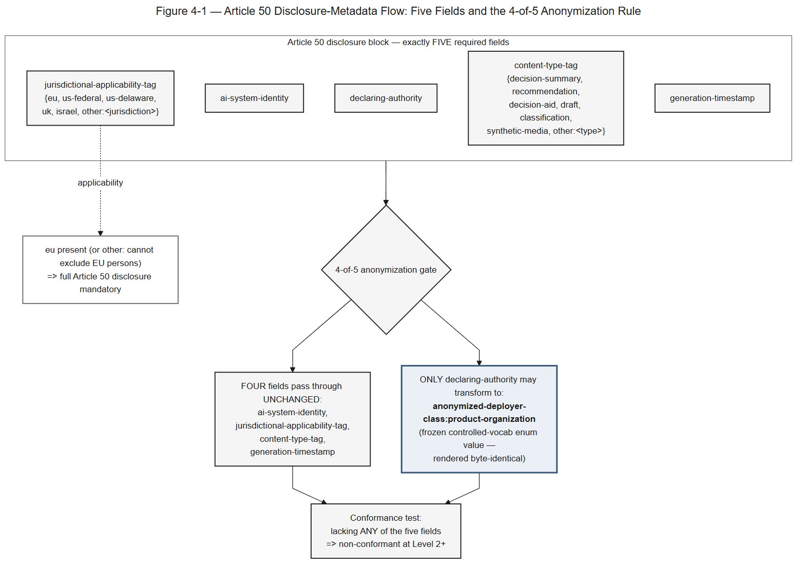
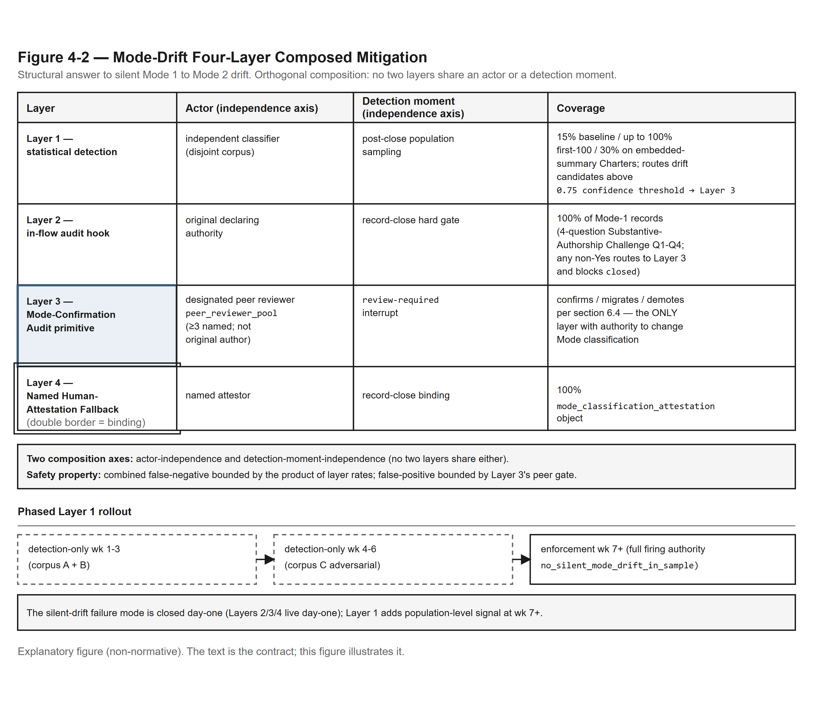
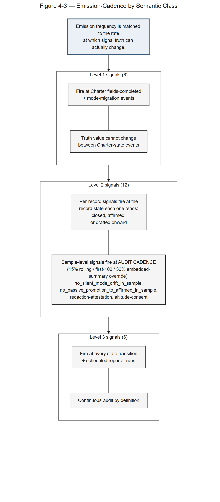

# Section 4 — Authority and Authorship in AI-Mediated Decisions

## 4.1 Authority and Authorship — Purpose

> ⚠️ **Not legal advice.** This Section of the Decision Provenance Standard™ is a normative document produced under the Etsion Brands Ltd. Steward role. It is not counsel. No attorney-client relationship is created by its production or use. Jurisdiction-specific questions, contested matters, and any decision with material legal or regulatory consequences require review by a licensed attorney in the relevant jurisdiction.
>
> **Jurisdiction Assumed:** U.S. federal + Delaware as primary; United Kingdom (England & Wales), European Union (Regulation (EU) 2024/1689 — the EU AI Act, particularly Article 50), and Israel as named secondaries. §4.6 carries its own Jurisdiction Assumed note.

---

Section 4 of this Standard establishes the **Mode taxonomy** that governs the relationship between a human author or reviewer and an AI worker participating in a decision made under a Charter. The Mode taxonomy is exhaustive: every decision a Charter dispatches is Mode 1 (Human-Led, AI-Enforced), Mode 2 (AI-Led, Human-Reviewed), or Mode 1 with the embedded-Mode-2-summary edge case. The three values fix the dispatch behavior the Standard's other Sections grade against: Section 6's per-record `dispatch_mode` field reads the Mode declaration the Charter authorizes, Section 5's lifecycle states (`draft` → `reviewed` → `affirmed`) apply uniformly across all Modes with the human affirmation event preserved as the load-bearing gate, Section 7's conformance signals key off Mode-disambiguated record samples, and Section 9's worked examples each carry an explicit Mode tag.

The Mode taxonomy is the load-bearing primitive for the Standard's regulatory cross-references. Section 4 sets the Standard's own disclosure block for Mode 2 outputs and for the Mode 1 edge case (§4.6, §4.7); whether Article 50 of the EU AI Act applies to an output is for the deployer to determine. Section 4 also states the Mode-Drift Composed Mitigation, the four-layer architectural answer to silent Mode 1 to Mode 2 drift, governing Charter operation under both Modes (§4.8).

Three structural commitments govern this Section. First, the canonical names "Mode 1 — Human-Led, AI-Enforced" and "Mode 2 — AI-Led, Human-Reviewed" are used in normative text. Second, the dispatch behavior the Mode declaration governs is specified by this Standard in Section 4 (the dispatch state machine across Modes, §4.2–§4.5) and Section 7 (the conformance-signal vocabulary the reporter reads). Third, the regulatory framing in this Section is process-claim discipline. The Mode taxonomy **records** which actor authored which artifact; it does not **certify**, **ensure**, or **satisfy** any regulatory obligation. The disclosure metadata schema **structures** disclosure inputs; it does not **discharge** any disclosure obligation. The Mode-Drift Composed Mitigation (§4.8) **provides** an architectural safety net against silent drift; counsel and auditors **convert** the resulting audit-ready provenance into evidence.

## 4.2 Mode 1 — Human-Led, AI-Enforced

A decision dispatched under a Charter whose `mode_declaration` is `mode-1` is authored by a human. The human is the **author of record**: the substantive decision content — the analysis, the options framing, the recommendation, the rationale, the sign-off — is produced by the named human author and signed off by that author at the decision's `closed` state. The AI worker participating in the decision flow is the **enforcement mechanism**: it reads the Charter state, validates that the human author's draft satisfies the Charter's structural requirements, and flags conformance-signal gaps the human must address before the dispatch state machine permits the record to close. The framing is succinct, and has an accessible form: **"Human-Led mode: AI checks the human."** That accessible-alias formulation is reserved for surfaces outside the Standard's normative envelope. In this Section and in every other normative document under this Standard, the canonical name is used.

Mode 1 dispatch authorizes the AI worker to write to a delimited set of fields on the decision record, and to no others. Per Section 6 §6.2, the AI worker in Mode 1 reads Charter state and decision-record draft state, and writes only conformance-signal fields — never the substantive decision content. The boundary is structural: an AI worker that wrote substantive content into a Mode 1 record would have departed from Mode 1 dispatch behavior and triggered the silent-drift failure mode that the Mode-Drift Composed Mitigation (§4.8) addresses. A Charter that intends AI authorship of substantive content declares Mode 2 (or, for the embedded-summary case, the third enumerated value). It does not run AI authorship under a Mode 1 Charter.

Mode 1 dispatch is the default register for Charters whose decision class is human-authored at Director or Executive altitude — positioning locks, design-system stewardship calls, partnership-architecture commitments, and executive-altitude decision interfaces. The Standard does not mandate Mode 1 as default; it permits Mode 1, Mode 2, and the Mode 1 edge case as exhaustive options at the Charter altitude, and the Charter's accountable owner declares which Mode the Charter authorizes. The default that holds in deployer practice is an empirical observation about where deployers are starting, not a normative requirement.

The Mode 1 dispatch state machine is specified in Section 6 §6.2 (the `dispatched` / `drafted` / `review-required` / `closed` record states) and §4.5 (Mode migration triggers). At `dispatched`, the human author opens the decision under a Charter at `fields-completed`, and the AI worker prepares the conformance-signal scaffold. At `drafted`, the human writes substantive content and the AI worker monitors conformance-signal completeness. At `review-required`, the AI worker holds the decision open if any Charter-required field is missing, and the human author addresses the gap. At `closed`, the human author signs off, the AI worker writes final conformance signals, and the record archives to the schedule of records. The state sequence is forward-only at the record altitude; amendments to a closed record are themselves new decisions producing their own records (per Section 6 §6.4 on amendment-as-decision).

The §4.6 disclosure block does not attach to Mode 1 records as a baseline matter, because the artifact reaching the reader is human-authored and the AI's contribution is internal to the production process rather than externalized in the output. The Mode 1 edge case at §4.7 governs the narrow circumstance in which AI-generated content is embedded inside an otherwise Mode 1 decision; that case carries the disclosure block at the embed point per the §4.6 metadata schema, even though the surrounding container is Mode 1.

---

## 4.3 Mode 2 — AI-Led, Human-Reviewed

A decision dispatched under a Charter whose `mode_declaration` is `mode-2` is authored by an AI system. The AI system is the **author of record**: the substantive decision content — the analysis, the options framing, the recommendation, the supporting rationale — is produced by the named AI system identified in the disclosure block (§4.6). A named human reviews the AI-authored draft before action is taken. The human is the **reviewer of record** and the **declaring authority** for the disclosure block that §4.6 requires on Mode 2 outputs. The framing is succinct, and has an accessible form: **"AI-Led mode: human checks the AI."** That accessible-alias formulation is reserved for surfaces outside the Standard's normative envelope. In this Section and in every other normative document under this Standard, the canonical name is used.

Mode 2 dispatch authorizes the AI worker to write the substantive decision content. Per Section 6 §6.2, the AI worker in Mode 2 reads Charter state, decision context, and prior decision records, and writes decision-record fields including substantive content and the disclosure metadata pointer that attaches the Article 50 block to the record. The reviewer of record reads the Charter state, the AI-authored decision-record draft, and the disclosure metadata block, and writes the reviewer sign-off, the dissent field if invoked, and the Mode 2 → Mode 1 demotion trigger if review determines the record requires substantive human re-authoring rather than revision. Mode 2 dispatch does not authorize the AI worker to sign off on its own output; sign-off is the human reviewer's responsibility, and the dispatch state machine refuses to close a Mode 2 record without the reviewer's recorded sign-off.

Mode 2 outputs carry the **disclosure block** that §4.6 sets as a load-bearing conformance requirement of this Standard. Whether Article 50 of the EU AI Act applies to a given output is for the deployer to determine.

Mode 2 dispatch is the appropriate register for decisions whose substantive analysis is produced by an AI system and reviewed by a human — AI-generated experiment summaries dispatched into a Data and Analytics Charter, AI-generated cohort-trajectory reads dispatched into a Customer-Outcome Charter, AI-assisted architecture-review outputs dispatched into an Engineering Charter, AI-generated portfolio-state summaries dispatched into an executive decision interface. The Standard does not enumerate which decision classes a Charter must dispatch in Mode 2; it permits Mode 2 dispatch under any Charter whose accountable owner declares Mode 2 in the Charter's `mode_declaration` field. The decision rests with the deployer; the Standard's role is to make the choice explicit and to attach the disclosure obligation to the chosen Mode.

The Mode 2 dispatch state machine is specified in Section 6 §6.2 and §4.5. The state transitions parallel Mode 1 but reverse the actor responsible for substantive authorship and review. At `dispatched`, the AI worker opens the decision and prepares the substantive draft and the disclosure metadata block. At `drafted`, the AI worker writes substantive content, and the disclosure block populates with `declaring_authority` (the human reviewer named in the Charter), `ai_system_identity`, `jurisdictional_applicability`, and `disclosure_text_pointer`. At `review-required`, the human reviewer reads the AI-authored draft and the disclosure block, and either signs off, requests revision, or invokes Mode 2 → Mode 1 demotion. At `closed`, the human reviewer signs off, the disclosure metadata block finalizes (`last_reviewed_at` set), and the record archives to the schedule of records.

A Mode 2 record's `disclosure_metadata_pointer` field is required at `drafted` per Section 6 §6.2.2; the absence of the pointer at `drafted` blocks the dispatch state machine from advancing to `review-required`. The structural enforcement closes the failure mode in which a Mode 2 record reaches close without an attached disclosure block — a Mode 2 record without a disclosure block is non-conformant against Section 7 Level 2 by construction and is a silent-drift-adjacent finding the Mode-Drift Composed Mitigation's Layers 2 and 4 catch independently of the dispatch state machine's enforcement.

---

## 4.4 The Mode-Declaration Field

The `mode_declaration` field on the Charter (Section 3 §3.4) and the `dispatch_mode` field on the decision record (Section 6 §6.2.1) are paired enumerated fields that fix the Mode taxonomy at the Charter altitude and at the per-record altitude. The two fields are designed to align, value-for-value, with the same three-element enumeration:

| Value | Charter altitude (`mode_declaration`) | Record altitude (`dispatch_mode`) |
|---|---|---|
| `mode-1` | Charter authorizes Mode 1 dispatch — Human-Led, AI-Enforced. Decisions made under this Charter have a human author of record. | Record was dispatched under a Mode 1 Charter and was authored by the named human author. |
| `mode-2` | Charter authorizes Mode 2 dispatch — AI-Led, Human-Reviewed. Decisions made under this Charter have an AI system as author of record and a named human reviewer of record. | Record was dispatched under a Mode 2 Charter, was authored by the named AI system identified in the disclosure block, and was reviewed by the named human declaring authority. |
| `mode-1-with-embedded-mode-2-summary` | Charter authorizes Mode 1 dispatch with the embedded-Mode-2-summary edge case — most decisions are human-authored, but specific decisions under the Charter may incorporate AI-generated summaries embedded within the human-authored decision. | Record was dispatched under a Mode-1-with-embedded-summary Charter; the substantive content is human-authored, and one or more embedded sub-outputs are AI-authored, each carrying disclosure metadata at the embed point per §4.6 and §4.7. |

The enumeration is exhaustive. A deployer who believes a fourth mode is needed routes the question through an issue or pull request, as GOVERNANCE.md sets out, not through a runtime workaround that invents a new value. The enumeration is fixed by design to prevent drift into hybrid descriptions ("human-led with some AI assistance"), marketing labels ("hybrid intelligence"), or invented modes whose dispatch behavior, disclosure metadata requirements, and conformance-grading consequences would each need to be interpreted on its own terms. Every deviation from the three values is itself a finding — the Mode-Drift Composed Mitigation's Layer 1 (statistical detection) and Layer 3 (peer-review interrupt) treat any record carrying a non-enumerated `dispatch_mode` value as a P0 finding routed to peer review.

The field is required at any Charter state past `open` and at any record state past `dispatched`. The required-at-state discipline is structural: a Charter in `open` cannot dispatch decisions because its mode is not yet declared; a record in `dispatched` cannot advance to `drafted` because its dispatch mode is not yet locked. The dispatch state machine (Section 4, with record states defined in Section 6 §6.2) enforces both gates; the Section 7 conformance-level reporter reads `mode_declaration_populated` (Charter altitude, Level 1 signal) and `every_record_carries_mode_declaration` (record altitude, Level 2 signal) directly from the field facts.

The canonical names pair with an accessible-alias pair used outside this text. In normative text, including this Section, Section 6 (Required Artifact Set), Section 7 (Conformance Levels), and Section 9 (Worked Examples), the canonical names appear. The accessible-alias pair is reserved for surfaces outside the normative envelope.

---

## 4.5 Mode 1 → Mode 2 Migration Narrative

The Standard does not prescribe the pace at which a deployer migrates Charters from Mode 1 to Mode 2. The migration narrative is captured in a single sentence:

> **Most enterprises start at Mode 1 and migrate to Mode 2 on their own clock; the Standard does not prescribe the pace.**

The sentence is locked. It does not appear elsewhere in normative text in modified form.

The migration mechanism, when a deployer chooses to migrate a Charter from Mode 1 to Mode 2, is specified in Section 4 §4.5 (Mode migration triggers) and is consumed by Section 6's amendment-as-decision treatment (§6.4). The mechanism is structural: a Charter at `fields-completed` whose accountable owner determines that Mode 2 is the appropriate register for the Charter's decision class amends the Charter's `mode_declaration` field through a named amendment that produces a decision record under the Charter. The amendment is itself a decision that the Charter governs; it has an accountable owner (the same human in `accountable_owner`), it dispatches under the Charter's pre-amendment `mode_declaration`, and it produces a record per the schedule of records. The Charter's post-amendment state operates under the new `mode_declaration` from the amendment record's `closed_at` timestamp forward; pre-amendment records in the schedule remain bound to the pre-amendment Mode for their own dispatch history.

The reverse direction — Mode 2 → Mode 1 demotion — is governed by three named triggers per Section 4 §4.5: review-driven demotion (the human reviewer determines the AI-authored draft requires substantive human re-authoring rather than revision), audit-driven demotion (a regulator, auditor, or counsel review of a closed Mode 2 record determines the disclosure was incomplete or the AI-system identity was inadequately documented), and escalation-driven demotion (the Charter's escalation rule fires and the escalation owner determines the decision must be re-authored by a human). Each trigger produces its own record per Section 6 §6.2.3 (the `prior_state_archive` field captures the demotion path enum tag, the prior record pointer, the trigger reference, the demotion reason, and the demotion timestamp). Demotion does not change the Charter's `mode_declaration`; it re-dispatches the affected decision under Mode 1 with the human now author of record and the original Mode 2 draft preserved in the prior-state field.

The migration narrative and the demotion mechanism are paired by design. A Charter that migrates Mode 1 → Mode 2 has chosen to authorize AI authorship for its decision class; the Standard makes the choice explicit and attaches the disclosure obligation to the chosen Mode. A specific decision under either Mode that requires Mode 2 → Mode 1 demotion is re-dispatched without changing the Charter's authorization; the Standard makes the demotion explicit and preserves the prior state for audit-readiness. Neither path permits silent re-moding at the record altitude.

---

## 4.6 Disclosure block for AI-drafted content

The disclosure block is this Standard's own requirement. This Subsection governs the prose Section 4 produces around the disclosure metadata schema specified in this Standard at §4.6.2. The §4.6.2 field list is the field-level substrate; this Subsection is the normative-text wrapper around it.

> **Jurisdiction Assumed for §4.6:** The disclosure block is this Standard's own requirement. Where the text mentions a law, the mention is a pointer; whether that law applies is for the deployer to determine.

### 4.6.1 Scope and Charter-Level Exclusion

Every Mode 2 artifact carries the disclosure block.

**Charter-level exclusion.** A Charter MAY declare its Mode 2 outputs outside this requirement where the deployer has verified that those outputs are produced outside the European Union and will not reach, and are not reasonably foreseeable to reach, people in the European Union. Without that declaration the requirement applies. This scope is carried over from rev. 8 and is the Standard's own choice; it says nothing about where any law applies. A Charter written before v1.1 (reading edition rev. 9) whose Mode 2 outputs already met this test remains valid without the declaration.

### 4.6.2 Mode 2 Output Conformance Requirements

A Mode 2 (AI-Led, Human-Reviewed) artifact under this Standard is any decision summary, recommendation, decision-aid, draft, classification, or other content where the AI system is the author of record and a named human is the reviewer of record per the Charter's dispatch state machine. Every Mode 2 artifact MUST carry transparency-disclosure metadata at the point of generation, attached to the artifact such that the metadata cannot be separated from the content through routine downstream handling (forwarding, anonymization, publication, or onward distribution).

The five-field disclosure schema and the 4-of-5 anonymization rule are illustrated by **Figure 4-1** (see **Companion D**).

*Figure 4-1 — Disclosure Block Flow. Explanatory, non-normative. (Full text-alternative: Companion D.)*

**Required metadata fields (these five define the disclosure metadata schema this Standard binds):**

1. **declaring-authority** — names the person who prepares the disclosure and the organization they act for. A record that names only the person, or only the organization, remains valid. New records SHOULD name both. Each is expressed as a stable identifier. The declaring authority is not the AI-system vendor.
2. **ai-system-identity** — the named AI system that produced the content, expressed as vendor + model + version (or equivalent stable identifier where vendor/model/version is not the relevant abstraction). Sufficient for a downstream reader to identify what produced the artifact.
3. **jurisdictional-applicability-tag** — one or more values from the controlled vocabulary `{eu, us-federal, us-delaware, uk, israel, other:<jurisdiction>}` declaring the jurisdictions in which the artifact is intended to circulate. The tag is an input to the deployer's own determination of which laws apply.
4. **content-type-tag** — one or more values from the controlled vocabulary `{decision-summary, recommendation, decision-aid, draft, classification, synthetic-media, other:<type>}` declaring what the artifact is. Different content types may carry different downstream disclosure-rendering requirements; the metadata captures the type, the rendering surface applies the rule.
5. **generation-timestamp** — ISO 8601 timestamp of generation. The timestamp records when the artifact was produced.

**Conformance test (Conformance Level 2 and above):** an artifact lacking any of the five required transparency-disclosure metadata fields is non-conformant under this Standard at Conformance Level 2 or above. A Charter that produces Mode 2 artifacts without attached transparency-disclosure metadata cannot claim Conformance Level 2 conformance. A reviewer or auditor encountering a Mode 2 artifact without complete metadata records the absence as a Conformance finding and the deployer remediates by re-issuing the artifact with the required metadata or by re-classifying the artifact as Mode 1 (and accepting the consequent authorship-of-record reassignment to the human, with all that entails).

### 4.6.3 Cross-Reference to Anonymization Protocol

Where a deployer anonymizes a Mode 2 artifact for publication, four of the five disclosure fields survive unchanged; the declaring authority may be replaced by a controlled-vocabulary placeholder such as `anonymized-deployer-class:product-organization`.

**Conformance requirement on anonymization (binding cross-reference):** anonymization MUST preserve the transparency-disclosure metadata required by §4.6.2. It cannot strip the AI-system-identity metadata or the Mode 2 declaration: the AI-system identity, the Mode 2 declaration, the jurisdictional-applicability tag, the content-type tag, and the generation-timestamp survive anonymization. The declaring-authority field is the only §4.6.2 metadata field that may be transformed during anonymization (e.g., from a named entity to a controlled-vocabulary placeholder such as `anonymized-deployer-class:product-organization`); the four other fields pass through unchanged.

The ratio is the **4-of-5 rule**: four of the five required metadata fields survive anonymization unchanged; one (the declaring authority) may transform to a controlled-vocabulary placeholder.

### 4.6.4 Conformance Authority

This Subsection's conformance language governs the disclosure block within the Decision Provenance Standard and is held to cross-jurisdictional consistency and the load-bearing language-discipline rule that audit-ready provenance is not a regulatory substitute. Section 8 of the Standard (maintained in Companion A) contains the parallel cross-references to NIST AI RMF Manage 4.1 and ISO/IEC 42001 (the AI/ISO interlocking trio), authored to maintain terminology coherence across the three frameworks. An implementation's disclosure metadata schema implements the five required fields enumerated in §4.6.2 above; any divergence between an implementation's schema and this conformance language is resolved by reference to this Subsection, which is authoritative.

---

## 4.7 Mode 1 Edge Case — Embedded AI-Generated Content

Mode 1 (Human-Led, AI-Enforced) dispatch generally does NOT carry the §4.6 disclosure block, because the human is the author of record and the AI system functions as a Charter-conformance check on the human's work — not as a content generator reaching the reader. The artifact reaching the reader is a human-authored document, and the AI's contribution is internal to the production process rather than externalized in the output.

**Edge case (binding).** Where AI-generated summary, recommendation, or decision-aid content is embedded INSIDE an otherwise human-authored Charter, decision record, or governance artifact, that embedded content is Mode 2 content even when the surrounding artifact is Mode 1. The authorship-of-record analysis is content-level, not container-level: a Mode 1 Charter that includes an AI-generated executive summary, an AI-drafted risk paragraph, or an AI-classified line item contains Mode 2 content at the embed point, and the §4.6 disclosure block applies to that embedded content irrespective of the container's Mode 1 classification. Whether Article 50 applies to it is for the deployer to determine.

**Conformance requirement:** embedded AI-generated content within an otherwise Mode 1 artifact MUST carry transparency-disclosure metadata at the embed point (per §4.6.2's five required fields), rendered such that a reader of the surrounding human-authored container can identify which spans of content are AI-generated and which are human-authored. Charter authors deploying this Standard MUST either (i) keep AI-generated content out of Mode 1 artifacts, or (ii) carry the §4.6.2 transparency-disclosure metadata at every embed point inside Mode 1 artifacts.

The structural handling for the edge case is the third enumerated value of the `mode_declaration` field, `mode-1-with-embedded-mode-2-summary` (§4.4 above). A Charter whose accountable owner anticipates that decisions under the Charter will incorporate AI-generated sub-outputs declares the third value at the Charter altitude; the Charter's `disclosure_metadata_pointer` becomes required at `fields-completed` per Section 3 §3.2; and per-decision-record disclosure metadata blocks attach with `mode_1_edge_case_flag` set to `true` per §6.2 (the record-schema field that carries the flag). The structural handling is what converts the edge case from an inferred reading of the Mode 1 framing into an explicit Charter-altitude declaration with field-level enforcement.

---

## 4.8 Mode-Drift Composed Mitigation

Silent Mode 1 to Mode 2 drift is the load-bearing risk this Section addresses. The pattern is mechanical: a record opens declared as Mode 1, the human author leans on AI worker output for substantive options framing, the record is materially Mode 2 but bears Mode 1 metadata, the disclosure block does not attach, and the disclosure this Standard requires is silently skipped. The recursion problem is that any mitigation built on the AI worker self-classifying its own output is itself an AI-fallibility surface.

The architectural answer is the **Mode-Drift Composed Mitigation**, a four-layer composition in which each layer is owned by a distinct functional role and no two layers share an actor or a detection moment. This Subsection states the four layers, names the cadence integration, and surfaces the one deployer-facing disclosure obligation the composition carries (§4.8.5).

### 4.8.1 The Four Layers (Composition Properties)

The four layers compose orthogonally on **actor independence** and **detection-moment independence**. No two layers rely on the same actor self-classifying the same record; no two layers fire at the same detection moment. The composition's safety property is that the combined false-negative rate is bounded by the product of the four layers' individual rates, and the combined false-positive rate is bounded by Layer 3's peer-review gate (the only layer with authority to materially change a record's Mode classification). The four-layer composition and the phased Layer 1 rollout are illustrated by **Figure 4-2** (see **Companion D**).

*Figure 4-2 — Mode-Drift Four-Layer Composed Mitigation. Explanatory, non-normative. (Full text-alternative: Companion D.)*

| Layer | Primary actor | Detection moment | Coverage |
|---|---|---|---|
| 1 — Statistical Detection | Independent classifier (different training corpus from worker output) | Post-close population sampling | 15% baseline; up to 100% on first-100 + edge-case Charters |
| 2 — In-Flow Audit Hook | Original declaring authority | Record-close transition (hard gate) | 100% of Mode-1-declared records at close |
| 3 — Mode-Confirmation Audit Primitive | Designated peer reviewer (not original author; not Charter owner if author) | `review-required` record state interrupt (per Section 6 §6.2 decision-record dispatch state machine) | All records routed by Layers 1 or 2; explicit invocation |
| 4 — Named Human-Attestation Fallback | Named human attestor, capacity recorded | Record-close binding | 100% of Mode-1-declared records at close |

Layer 1 samples Mode-1-declared closed records using an independent Mode-2-trained classifier whose corpus is constructed to be disjoint from any AI worker output it later classifies; the 15% baseline rises to 100% on a Charter's first 100 records (no priors, high cost of missing early drift) and to 30% on Charters declaring `mode-1-with-embedded-mode-2-summary` (structural surface for drift). Layer 2 fires a four-question Substantive-Authorship Challenge at the record-close transition — Q1 (options framing), Q2 (recommendation/rejected options/criteria), Q3 (verbatim/near-verbatim AI prose), Q4 (counterfactual: would the conclusion stand if AI contributions were removed from working materials). Yes or Uncertain on Q1–Q3, or anything but Yes on Q4, or a declined answer, or a Layer 1 / Layer 2 mismatch, routes the record to Layer 3 at `review-required` and blocks `closed`. A record that closed before v1.1 (reading edition rev. 9) keeps the route recorded with it (`routing_decision`, with the `challenge_prompt_version` shown); the route above applies to records that close under v1.1 (reading edition rev. 9) or a later release. Layer 3 holds the record at `review-required` and escalates to a designated peer reviewer who confirms the Mode declaration, requests a Mode 1 → Mode 2 migration, or invokes Mode 2 → Mode 1 demotion per Section 4 §4.5. Layer 4 binds the final Mode declaration at record close through a named human attestation field. The attestation records who signed and in what capacity. The Standard makes no claim about how that capacity, or any indemnity a deployer offers, affects anyone's personal liability.

The silent-drift failure mode is closed from day one because Layers 2, 3, and 4 are live from day one. Layer 1 deploys phased: detection-only weeks 1-3 (corpus Layers A+B); detection-only weeks 4-6 (corpus Layer C adversarial-corpus construction); enforcement-mode week 7+ (full firing authority for the `no_silent_mode_drift_in_sample` Level 2 conformance signal). The phased plan does not defer that closure; the composition closes the silent-drift failure mode, and Layer 1's full firing authority adds population-level signal at week 7+.

### 4.8.2 Emission-Cadence Integration

The emission cadence is the seam between the dispatch state machine (Section 6 §6.2) and the conformance-signal vocabulary (Section 7). It binds emission cadence to the signal's semantic class, not to the level number. The Mode-Drift Composed Mitigation (§4.8.1) operates against this cadence. The cadence-by-semantic-class mechanism is illustrated by **Figure 4-3** (see **Companion D**).

*Figure 4-3 — Emission-Cadence by Semantic Class. Explanatory, non-normative. (Full text-alternative: Companion D.)*

| Semantic class | Emission cadence | Mode-drift coupling |
|---|---|---|
| Level 1 (Charter-altitude state facts) | At Charter `fields-completed` and on subsequent mode-migration events that mutate Charter state | Layer 1's `mode_declaration_populated` and Layer 2's gating apply at Charter transitions |
| Level 2 (per-record end-state facts; sample-level audit facts) | Per-record signals at record `closed`; sample-level signals at audit events | Layer 3 fires `no_silent_mode_drift_in_sample` on its declared audit cadence (per Layer 1 sampling rules above), not on every dispatch transition — this is what makes Layer 1's compute load tractable |
| Level 3 (continuous-audit facts) | Every state transition of every decision record + scheduled reporter runs per Charter reporting cadence | Layer 1's soft-flag aggregate (>5% rolling 30-day) emits a Charter-level escalation independent of any single record's hard flag |

The split-by-class rule matches emission frequency to the rate at which signal truth can actually change. The Section 4 normative text references this cadence verbatim: every Conformance Level requirement Section 4 surfaces in §4.6.2 (disclosure metadata) reads through the emission cadence at the Section 7 grading altitude. The reference files carry a small dispatch table mapping signal name to emission trigger (the signal list). Layer 3 of the Mode-Drift Composed Mitigation emits the Level 2 sample-level `no_silent_mode_drift_in_sample` signal on its audit cadence per this emission rule.

### 4.8.3 Layer 4 Attestation Field

The structured attestation field on the decision record is `mode_classification_attestation` — an object (not a scalar; a scalar invites copy-paste, an object forces sub-fields to populate) carrying eight fields: `attestor_full_name`, `attestor_role_title`, `attestor_employer`, `attestation_timestamp` (UTC, system-stamped, not user-editable), `jurisdiction` (enum: US-DE | US-FED | UK | EU | IL | OTHER), `attestation_language_version`, `attestation_text_signed` (the verbatim language signed), and `attestor_capacity` (enum: employee | contractor | officer | director). Section 6 of this Standard incorporates the field at the per-record altitude; this Section establishes the structural requirement and the load-bearing properties.

The attestation references the Layer 2 challenge-prompt answers as the substantive evidentiary base: the attestor reviews the four logged answers (Q1–Q4) on the record before signing. The attestor signs onto the proposition that **given those four answers and any Layer 3 resolution**, the recorded Mode classification accurately reflects the substantive role of AI worker output. The attestation is identity-bound; the verbatim attestation language is jurisdiction-conditioned (U.S. base, UK variant, EU variant, Israel variant). The attestation records who signed and in what capacity. The Standard makes no claim about how that capacity, or any indemnity a deployer offers, affects anyone's personal liability.

The default attestor is a senior IC or middle-manager employee, with officer/director attestation reserved for escalations. The default keeps the attestation-availability property of the safety net intact; concentrating attestation on officers/directors creates a single point of failure for the composed architecture (a regulator-inquiry-induced refusal to sign by an officer cascades through every Charter that depends on attestor availability).

### 4.8.4 Normative Text and the Reference Files

Sections 4.8.1 to 4.8.3 are the normative statement of the Mode-Drift Composed Mitigation. The files in `standard/v5.0/mode-drift/` are an informative description of them; where they differ, this text governs.

### 4.8.5 Deployer Disclosure of the Layer 1 Conservative-Posture Window

One deployer-facing disclosure obligation attaches to the Layer 1 phased deployment. During the Layer 1 detection-only window (weeks 1-6, while the adversarial corpus is still being constructed), the `no_silent_mode_drift_in_sample` Level 2 signal emits in a known-conservative posture: false negatives are possible because the corpus is incomplete. Deployers reading their own conformance reporter during that window MUST be told this. Burying the detail in internal documentation creates a trust problem, so the Implementation Guidance (Companion C) carries it as a required deployer-facing disclosure. A separate open question, whether classifier-version increments count as "clarifying" or "substantive" under the minor-release non-break rule, is resolved in Section 7 (Appendix G §G.7.5) since conformance-level grades may shift on the same Charter as the classifier retrains.

---

## 4.9 Worked-Example Template

Section 9 of this Standard presents seven worked examples across common function-specific Decision Interface Charters and two across executive-altitude interfaces, each carrying its locked Mode tag. This Subsection establishes the template Section 9 worked examples follow, with order-of-magnitude banding for any quantitative success criteria the worked example surfaces.

The template has six elements:

1. **Charter or interface name** (the worked example's own title).
2. **Decision class** the Charter governs (recurring class; not a one-off event).
3. **Mode tag**, declared per §4.4 enumeration: `mode-1`, `mode-2`, or `mode-1-with-embedded-mode-2-summary`. Where a Charter operates a dual-mode dispatch (a register-agnostic Charter that runs multiple decision classes), the dual-mode declaration records the decision-class-level Mode declaration in the Charter state model field.
4. **Disclosure block** declared explicitly: *Disclosure block required under §4.6: yes/no* (for Mode 1 with embedded summaries, yes at the embed point), followed by *Whether Article 50 applies: for the deployer to determine.*
5. **Quantitative success criteria with order-of-magnitude banding.** Worked-example success criteria that surface quantitative metrics use order-of-magnitude banding rather than precise figures. The banding ratio is **0.5×–2×** of the deployer's declared baseline: a worked example illustrating a metric's structural role names the metric and the order of magnitude its acceptable range falls within (e.g., "the metric thresholds fall within 0.5× to 2× the deployer's declared baseline" rather than "the metric must be ≥ 47%"). The banding is designed so that worked examples remain useful as templates without surfacing precise figures that vary by deployer scale, segment, and operating cadence, and so that anonymized published install references preserve the worked-example utility without exposing deployer-specific operating data. Section 6 §6.4 (the Business-Case / Continuation-Threshold field schema) carries the same banding discipline at the per-record altitude.
6. **Implementation-context note** describing the organizational, executive, or operational context the Charter operates in, in the Standard's own words. The note uses process-claim verbs only ("describes," "frames," "operates," "is filed," "is re-decided"), never substantive-claim verbs ("ensures," "satisfies," "certifies").

The template covers Mode 1, Mode 2, and Mode 1-with-embedded-Mode-2-summary cases through the seven function-specific Charters and two executive-altitude interfaces. The Product Marketing Decision Interface Charter (Worked Example 9.1) is canonically Mode 1. The Data and Analytics Decision Interface Charter (Worked Example 9.4) is the Charter with the most embedded AI-generated content, with most modern analytics environments dispatching AI-generated artifacts that carry the disclosure block for experiment summaries, cohort reads, and metric-drift detections. The CEO–CPO interface (Worked Example 9.8) operates as Mode 1 with Mode 2 dispatch on AI-generated portfolio-state reads, surfacing the embedded-summary edge case at the executive altitude. The seven-Charter coverage and the two executive-altitude interfaces span the three enumerated Mode values with sufficient density that a deployer reading Section 9 encounters worked examples in each Mode register.

---

## 4.10 Explicit Non-Claim — the Disclosure Block

Whether an Article 50 disclosure obligation applies to an artifact, and who carries it, is for the deployer to determine. The Standard's disclosure-block schema (§4.6.2) and the conformance language at §4.6 are **structural transparency requirements** that structure the inputs counsel and the declaring authority consume; they do not discharge the obligation. Counsel and auditors convert audit-ready decision provenance into evidence, certifications, or attestations as their professional judgment requires; the artifacts produced under this Standard do not. Whether any of these outputs needs legal review is for the deployer to determine. For the global non-claim set, see §1.4.2.

---

