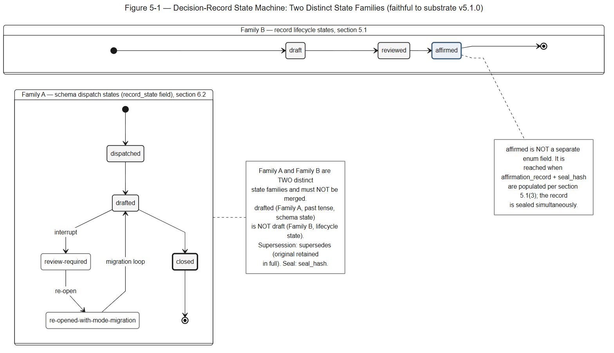

# Section 5 — Record Lifecycle States

> **Disclaimer pointer.** The "Use of the Standard" notice and the Jurisdiction Assumed declaration governing this Section live at the top of the Decision Provenance Standard™. This Section is normative; it inherits the preamble's notice without paraphrase. Section 5 specifies the lifecycle states a decision record transits from creation through review to affirmed-and-sealed status. The lifecycle is the structural primitive that distinguishes this Standard from real-time telemetry frameworks: Decision Provenance Standard records carry decisions made by named human actors with time for review, gated on an explicit human affirmation event.

---

## 5.1 Record Lifecycle States

The record lifecycle states, and their relationship to the separate schema dispatch states of §6.2, are illustrated by **Figure 5-1** (see **Companion D**).

*Figure 5-1 — Decision-Record State Machine: Two Distinct State Families. Explanatory, non-normative. (Full text-alternative: Companion D.)*

Every Decision Provenance Standard record progresses through three lifecycle states, in order:

1. **`draft`** — record has been created and populated with proposed decision content. May be edited freely. Has no audit standing.

2. **`reviewed`** — record has been reviewed by at least one party other than the original drafter, with review comments captured in the `review_log` field. Edits remain permitted but are tracked in `revision_history`.

3. **`affirmed`** — record has been explicitly affirmed by the named decision owner via affirmative action (signature, approval token, or equivalent human-actor signal captured in the `affirmation_record` field). The act of affirmation is itself a record event with timestamp, actor identity, and affirmation method. The record is sealed simultaneously: hash of the affirmed record computed and stored in `seal_hash`. Subsequent corrections require a new record that supersedes the prior affirmed one via the `supersedes` field, with the original retained in full.

## 5.2 Affirmation Requirement (load-bearing)

A record SHALL NOT enter the `affirmed` state without an explicit human affirmation event recorded in §5.1(3). Implementations MUST NOT auto-promote records based on time elapsed, absence of objection, default approval, or any passive signal. **Affirmation is an affirmative human act.**

## 5.3 Standard Scope (intentional non-coverage)

The Decision Provenance Standard™ is intentionally NOT a real-time telemetry format. It does not specify wire protocols for sub-second event capture, agent tool-call observability, or machine-to-machine audit streams. Implementations seeking those properties should use protocols designed for them and reference the resulting traces from Decision Provenance Standard records as supporting evidence under §6 (Required Artifact Set / Evidence Attachment), where appropriate.

Decision Provenance Standard records carry decisions made by named human actors with time for review. The Standard's design properties — sequential lifecycle, mandatory affirmation, immediate-on-affirmation sealing — are calibrated for that decision class and are not appropriate for high-volume machine-event capture.

---

## 5.4 Operational Use of the Lifecycle Across Sections

The §5 lifecycle states are consumed by three subsequent sections of the Standard:

**Section 6 (Required Artifact Set)** specifies the field-level shape of the lifecycle: the `affirmation_record` field's required sub-fields (timestamp, actor identity, method), the `seal_hash` field's computation rule, the `supersedes` field's reference semantics, the `review_log` field's structure, and the `revision_history` field's append-only discipline. Section 6 is the schema; Section 5 is the state machine.

**Section 7 (Conformance Levels)** binds named conformance signals to lifecycle properties. `every_affirmed_record_carries_affirmation_event` is a Level 2 signal; `every_affirmed_record_carries_seal_hash` is a Level 2 signal; `superseded_records_retained_in_full` is a Level 3 signal; `no_passive_promotion_to_affirmed_in_sample` is a Level 2 signal that audits a sample for compliance with the §5.2 affirmation requirement.

**Section 8 (Regulatory Cross-References)** notes where the lifecycle's properties produce structural inputs counsel and auditors find useful: the affirmation event is the structural primitive that distinguishes Decision Provenance Standard records from passive log entries when counsel evaluates a record's role under named oversight frameworks; the seal is the structural primitive that captures content at affirmation time when an audit moment is reconstructed; the supersedes mechanism is the structural primitive that preserves the audit trail across corrections. None of these structural properties satisfies any framework's requirements; they inform the qualified personnel who do.

The lifecycle is silent on substantive correctness. A record at `affirmed` is a record whose owner has affirmed its content; the affirmation does not certify that the decision is correct, that the analysis is sound, or that the outcome will land. Counsel and auditors form those substantive judgments. The Standard records the affirmation; the substance is the deployer's.

---

## 5.5 Redaction Events and the Seal Integrity Property

The seal-hash immutability requirement at §5.1(3) is preserved through erasure events via the **redaction-event** record pattern. A redaction event is itself a decision record (with `record_type` set to `redaction_event` per §6.2.3) that progresses through the §5 lifecycle states (`draft` → `reviewed` → `affirmed`) like any other decision record; the affirmation event seals the redaction-event record via its own `seal_hash`. The target record's original `seal_hash` remains valid; the redaction-event record makes the deployer's recorded removal of named fields auditable without modifying the prior sealed record.

The framing this Standard adopts is **redaction-as-new-affirmed-record**: an erasure is not a deletion of the prior record but a new sealed record that records the deployer's statement that the named fields have been removed from operational use, while the archival record keeps its integrity. The record does not by itself remove or erase anything. Whether the removal meets any erasure right is for the deployer to determine. The Standard does NOT specify the deployer's operational-store erasure mechanism (which depends on the deployer's data architecture, storage substrate, and whatever erasure rule applies to the deployer); the Standard specifies the audit-trail integrity property the redaction event records. Section 6 §6.2.3 carries the redaction-event field schema; §6.2.3.2 carries the access-policy binding; §A.2.bis carries the EU GDPR Article 17 cross-reference (which is a distinct framework from EU AI Act Article 17 covered at §A.2); §A.bis carries other-jurisdiction erasure-right cross-references.

---

---

