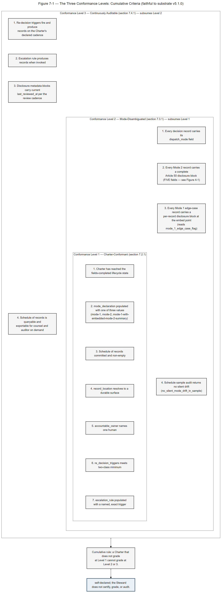

# Section 7 — Conformance Levels

> **Disclaimer pointer.** The "Use of the Standard" notice and the Jurisdiction Assumed declaration governing this Section live at the top of the Decision Provenance Standard™. Readers arriving at this Section directly should read Section 1 first.

---

> *Conformance Levels are self-declared by the adopting organization. The Standard's Steward does NOT certify, grade, or audit conformance. Self-declaration is recorded by the org in its own decision register; the Steward maintains no central registry of conformant orgs.*

---

## 7.1 Purpose of Conformance-Level Grading

Section 7 of the Decision Provenance Standard™ defines three named tiers — Conformance Level 1, Conformance Level 2, and Conformance Level 3 — at which a Charter satisfies the Standard's structural requirements. Each level is a structured fact about field population, lifecycle-state attainment, and emission cadence read off the fields Sections 3, 4, 5, and 6 define. A Charter's declared conformance level (per Section 3 §3.2 `conformance_level_declared`) is the deployer's commitment; the Section 7 conformance-level reporter assesses whether the structural facts at the Charter altitude, the decision-record altitude, the lifecycle altitude, and the schedule-of-records altitude bear out the declaration.

The grading mechanism is structural. It reads named, machine-readable signals from the dispatch state machine (Section 4), the lifecycle state transitions (Section 5), and the conformance-signal vocabulary (Section 7), assembles them into a level grade, and reports the grade as a structured output. The reporter's output is a fact about field population and structural completeness; it is not a substantive judgment, a regulatory determination, or a certification.

**Self-declaration mechanics (self-declared, per Appendix G §G.11.3).** A deployer's conformance-level reporter reads the Charter and decision-record fields the Standard defines, applies the criteria in §7.2, §7.3, and §7.4 below, and produces a level grade as a structured output stored in the deployer's own decision register. The grade is the deployer's self-declaration. The Standard's Steward (see §11.2) does not validate the self-declaration, does not maintain a central registry of self-declarations, does not issue grades on the deployer's behalf, and does not audit the underlying records. A third-party reader of the deployer's self-declaration (a counterparty performing diligence, a regulator forming an oversight view, an auditor preparing an attestation) reads the self-declaration as one input among others and forms their own judgment on its weight.

### What Section 7 grades

Section 7 grades five things, each at the altitude the Standard sets for it:

The **Charter state-event surface** (Section 3 §3.3): whether the Charter has reached `fields-completed`, whether the required mode-declaration field is populated with one of the three enumerated values, whether the schedule of records is committed and non-empty, whether the `record_location` resolves, whether the `accountable_owner` is one named human, and whether the re-decision triggers meet the two-class minimum (one outcome-evidence + one market-evidence trigger).

The **lifecycle-state surface** (Section 5): whether every closed decision record has reached the `affirmed` state per Section 5.1(3) with an affirmation event recorded in `affirmation_record` and a seal stored in `seal_hash`, whether superseded records are retained in full per Section 5.1(3)'s supersedes mechanism, and whether sample audits surface no records that have been silently promoted to `affirmed` without an explicit human affirmation event (per §5.2 load-bearing requirement).

The **per-record end-state surface** (Section 6 §6.2): whether every decision record under the Charter carries its `dispatch_mode` field, whether every Mode 2 record within the §4.6 requirement (§4.6.1) carries a complete disclosure block (the five fields of §4.6.2), whether every Mode 1 edge-case record carrying the `mode_1_edge_case_flag` carries a per-record disclosure block at the embed point where the embedded content is within the §4.6 requirement, and whether the Mode-Drift Composed Mitigation's Layer 3 sample audit (per Section 4 §4.8) returns no silent drift findings on the schedule sample.

The **schedule-of-records discoverability surface** (Section 6 §6.3 and §6.4): whether the schedule is queryable and exportable per the Standard's findability hygiene rule (a record reachable in 30 seconds by someone not in the room), whether record locations resolve durably, whether stable identifiers persist across ownership changes and surface migrations, and whether retention discipline is operationally enforced on the cadence the Charter declares.

The **emission-cadence surface**: whether signals fire at the cadence bound for each signal's semantic class — Charter-state-event-driven for Level 1 signals, per-record-close + sample audit-cadence for Level 2 signals, and every-transition + scheduled reporter runs for Level 3 signals.

### What Section 7 does NOT grade

Three explicit non-claims govern the grading mechanism. They are load-bearing — they are why Section 7 grades are useful as inputs to qualified personnel, and why Section 7 grades are not regulatory work themselves.

**Conformance Level grading is not compliance certification.** No third-party certifying body issues Conformance Level grades against this Standard. The grades are structured outputs a deployer's conformance-level reporter declares, read off field facts the deployer's Charter and decision records expose. The Standard is published under CC-BY 4.0 as an open standard; the Standard's Steward does not certify, grade, or audit conformance (per the locked lead paragraph above and §11.2). A deployer who reads Section 7 grades as compliance certifications has misread the Section.

**Conformance Level grading is not audit defense.** A Charter that grades at Level 3 has produced audit-ready decision provenance at the structural standard the Standard names. It has not produced evidence, satisfied an obligation, discharged a regulatory duty, or substituted for a regulator's review. Counsel and auditors convert audit-ready provenance into evidence; the Section 7 grade is an input to that conversion, not the conversion itself.

**Conformance Level grading is not a regulatory substitute.** Section 7 grades the structural completeness of a Charter against the Standard. It does not opine on whether a Charter satisfies any obligation under the EU AI Act, the U.S. National Institute of Standards and Technology AI Risk Management Framework, ISO/IEC 42001, GDPR, SOX, the Caremark line of Delaware oversight cases, or any other regulatory regime. Where a Charter governs a decision class touching a regulated activity, whether any regulatory obligation applies, and who carries it, is for the deployer to determine. Section 7 grades the Charter's structural inputs to any such review; it does not perform the review.

The corrected formulation, used throughout this Section and binding for Standard-side text on conformance-level grading, is that Section 7 grades **declare the structural conformance level a Charter has reached against this Standard, as self-declared by the adopting organization**. Counsel, auditors, and the deployer's accountable personnel consume Conformance Level grades as one input among many to their substantive work; the grade is not their work, and the grade does not substitute for their review.

---

**Lifecycle conformance signals (integrated into §7.3 Level 2 and §7.4 Level 3):**

| Signal | Level | Meaning |
|---|---|---|
| `every_affirmed_record_carries_affirmation_event` | Level 2 | Every record at `affirmed` state has a populated `affirmation_record` field with timestamp, actor identity, and method per §5.1(3). |
| `every_affirmed_record_carries_seal_hash` | Level 2 | Every record at `affirmed` state has a populated `seal_hash` field per §5.1(3). |
| `no_passive_promotion_to_affirmed_in_sample` | Level 2 | A sampled audit of `affirmed` records returns no records whose affirmation method is a passive signal (time elapsed, absence of objection, default approval) per §5.2 load-bearing requirement. |
| `superseded_records_retained_in_full` | Level 3 | Records that have been superseded via the supersedes mechanism remain in the schedule of records, immutable, with the current record carrying a `supersedes` reference per §5.1(3). |
| `every_mode_2_record_carries_drafting_authority` | Level 2 | Every record at `affirmed` whose `dispatch_mode` is `mode-2` or `mode-1-with-embedded-mode-2-summary` carries a populated `drafting_authority` field with a populated `deployer_role_pointer` sub-field per §6.2.3. The signal is a field-population audit, no substantive judgment. |
| `altitude_to_consent_posture_binding_enforced` | Level 2 | A sampled audit of records at `altitude: individual-professional` returns no records whose `consent_posture.consent_record_pointer` is null, no records whose `consent_posture.withdrawal_state` is `withdrawn-stream-stopped` and yet carry a post-withdrawal `affirmation_record`, and no records readable by reader principals outside those enumerated in the Charter's use-case scope-limit declaration per §6.2.3.1. The signal is a structural enforcement audit. |

These six signals are also listed in the §7.3.2 and §7.4.2 tables, at the level given here. The conformance-signal vocabulary has 23 signals: 6 Level 1, 11 Level 2, 6 Level 3.

**Level rules outside the tables.** Besides the tables in §7.2 to §7.4, some sections bar or grade a Level directly (for example §3.1, §6.2.3.1 and §6.2.3.2). Among them: a record that lacks a field required at its lifecycle state is a Level 1 failure (§6.2.4), and Level 3 reads the discoverability and retention rules of §6.4 (§6.5.2).

## 7.2 Conformance Level 1 — Charter-Conformant

Conformance Level 1 grades the Charter as a structurally complete artifact. A Charter at Level 1 has reached the `fields-completed` lifecycle state (per Section 3 §3.3), has declared one of the three enumerated mode values in `mode_declaration` (per Section 3 §3.4 and Section 4 §4.4), has committed a non-empty schedule of records (per Section 3 §3.2 and Section 6 §6.3), names a single human in `accountable_owner` (per Section 3 §3.2), and resolves its `record_location` to a durable, queryable surface (per Section 6 §6.4). The required-at-state field discipline established in Section 3 §3.2 governs the grading; a Charter that omits any required-at-state field at the field's required state has not reached the state and cannot grade at Level 1. The three cumulative conformance levels are illustrated by **Figure 7-1** (see **Companion D**).

*Figure 7-1 — The Three Conformance Levels: Cumulative Criteria. Explanatory, non-normative. (Full text-alternative: Companion D.)*

### 7.2.1 Level 1 criteria

A Charter grades at Level 1 when, and only when, every Level 1 criterion below is satisfied.

| Criterion | Where defined | Source |
|---|---|---|
| Charter has reached the `fields-completed` lifecycle state | Section 3 §3.3 | All required-at-state fields populated through `fields-completed` |
| `mode_declaration` populated with one of three enumerated values (`mode-1`, `mode-2`, `mode-1-with-embedded-mode-2-summary`) | Section 3 §3.4; Section 4 §4.4 | Required at any state past `open` |
| Schedule of records committed and non-empty | Section 3 §3.2; Section 6 §6.3 | Enumerated by record-type at minimum: Decision record, Re-decision record, Escalation record, Charter-amendment record, Disclosure-review record (MUST be enumerated when `mode_declaration` is `mode-2` or `mode-1-with-embedded-mode-2-summary`; SHOULD be enumerated by a `mode-1` Charter whose records embed AI-drafted content carrying a disclosure block (§4.7); not required for a `mode-1` Charter whose records carry no AI-generated content). rev. 8 already applied disclosure-review records "per dispatch mode" to `mode-2` and `mode-1-with-embedded-mode-2-summary` Charters; v1.1 (reading edition rev. 9) makes this explicit; a Charter written before v1.1 whose schedule met rev. 8's requirement remains valid without adding disclosure-review records. A Charter whose Mode 2 outputs are outside the §4.6 requirement, by declaration or under the §4.6.1 transition sentence, carries no disclosure block for them, so it needs no disclosure-review record for them. |
| `record_location` resolves to a durable surface | Section 3 §3.2; Section 6 §6.4 | The Charter's index that enumerates the schedule of records resolves and is queryable by record-type and by date range at minimum |
| `accountable_owner` names one human | Section 3 §3.2 | A person, not a role, team, or organizational unit; one and only one |
| `re_decision_triggers` meets two-class minimum | Section 3 §3.2 | At least one outcome-evidence trigger and one market-evidence trigger |
| `escalation_rule` populated with a named, exact trigger | Section 3 §3.2 | A pre-declared condition that elevates a decision out of the Charter's standing forum; not "when it feels stuck" |

A Charter satisfying every criterion above is Charter-conformant against this Standard at the Charter altitude. The grade is a structured fact about field population read off the Charter state at the moment the reporter runs.

### 7.2.2 Level 1 reporter signals

The conformance-level reporter assembles the criteria above from the named, machine-readable signals defined in the conformance-signal vocabulary (Section 7, Level 1 signals). Each signal is field-level; the reporter reads the signal value and grades the criterion.

| Signal | Meaning |
|---|---|
| `charter_state_is_fields_completed` | Charter has reached `fields-completed` |
| `mode_declaration_populated` | `mode_declaration` is one of the three enumerated values |
| `schedule_of_records_committed` | The schedule is enumerated and non-empty |
| `record_location_resolvable` | The Charter's index URL or path resolves and contains the schedule |
| `accountable_owner_named` | One and only one named human in `accountable_owner` |
| `re_decision_triggers_minimum_met` | Outcome-evidence trigger + market-evidence trigger present |

Per the emission-cadence rule (§4.8.2), Level 1 signals emit on the **Charter state-event** trigger: at the transition into `fields-completed` and on subsequent **mode-migration events** that mutate Charter state through a named amendment. Mid-lifecycle decision-record transitions do not emit Level 1 signals; the truth value of a Level 1 signal cannot change between Charter-state events, so emitting on every record transition would be noise. The reporter reads the most recent Level 1 signal emission for each signal when it grades.

### 7.2.3 What Level 1 declares

A Level 1 grade declares that the Charter is structurally complete: it has named what it governs, who owns it, what mode it dispatches in, where its records live, and what triggers reopen its decisions. The grade does not declare anything about the substantive content of decisions made under the Charter, the regulatory adequacy of those decisions, or the operational quality of the Charter's execution. A Charter at Level 1 with poorly authored decisions or unenforced re-decision triggers is still a Charter at Level 1; the substantive and operational deficiencies surface at Level 2 and Level 3 grading respectively, not at Level 1.

The Level 1 grade is the foundation tier. A Charter that does not grade at Level 1 does not grade at Level 2 or Level 3, because the higher levels presuppose Level 1 structural completeness. A deployer whose Charters do not yet grade at Level 1 is in the install phase of the Standard — Section 10 (Implementation Guidance) addresses the install pathway — and conformance against this Standard is not yet assessable.

---

## 7.3 Conformance Level 2 — Mode-Disambiguated

Conformance Level 2 grades the Charter at the per-record end-state altitude. A Charter at Level 2 satisfies every Level 1 criterion and additionally satisfies four per-record-altitude criteria: every decision record carries its `dispatch_mode` field, every Mode 2 record within the §4.6 requirement (§4.6.1) carries a complete disclosure block (the five fields of §4.6.2), every Mode 1 edge-case record (carrying the `mode_1_edge_case_flag`) whose embedded content is within the §4.6 requirement carries a per-record disclosure block at the embed point, and the Mode-Drift Composed Mitigation's Layer 3 sample audit returns no silent drift findings on the schedule sample.

The Level 2 grade is the load-bearing tier for the Standard's regulatory cross-references. A Charter that grades at Level 2 has produced records whose authorship is disambiguated at the per-record altitude, whose disclosure metadata is structurally attached where required, and whose silent-drift exposure has been audited at the cadence Section 4 §4.8 binds. The grade is the structural input that disclosure work under EU AI Act Article 50 (where the deployer determines it applies), the U.S. NIST AI Risk Management Framework Manage 4.1 implementation, and ISO/IEC 42001 conformance-readiness work consume — counsel and auditors convert the Level 2 grade into evidence for those frameworks. The grade itself remains a structural fact, not a regulatory determination.

### 7.3.1 Level 2 criteria

A Charter grades at Level 2 when, and only when, every Level 1 criterion is satisfied and every Level 2 criterion below is satisfied.

| Criterion | Where defined | Source |
|---|---|---|
| Every decision record under the Charter carries its `dispatch_mode` field | Section 6 §6.2.1 | Required at the `dispatched` lifecycle state; cannot be silently mutated: a change of mode appears as a new, re-dispatched record (§4.5, §6.2.1), so a record's current value is its dispatched value, and no history of past values is required. |
| Every Mode 2 record within the §4.6 requirement (§4.6.1) carries a complete disclosure block (the five fields of §4.6.2) | Section 4 §4.6; Section 6 §6.2.2; §4.6.2 | The five required disclosure-block fields populated; declaring authority named; AI-system identity recorded |
| Every Mode 1 edge-case record whose embedded content is within the §4.6 requirement (§4.6.1) carries a per-record disclosure block at the embed point | Section 4 §4.7; Section 6 §6.2.2 | `mode_1_edge_case_flag` true on the record; per-record disclosure pointer attached |
| The schedule-of-records sample audit returns no silent drift findings | Section 4 §4.8 (Layer 3, §4.8.1) | Layer 3's `no_silent_mode_drift_in_sample` signal emits at the cadence Section 4 §4.8 binds; the audit-driven Mode 2 → Mode 1 demotion path (per Section 4 §4.5 and Section 6 §6.2.3) produces no peer-confirmed drift findings on the sample. Applies where the Charter has Mode 1 records (`mode-1`, or `mode-1-with-embedded-mode-2-summary`) to sample. Until it has, there is nothing to audit: this criterion does not apply and does not prevent a Level 2 grade. |

The fourth criterion is the Mode-Drift Composed Mitigation audit-cadence binding (Section 4 §4.8). The Level 2 grade depends on the sample audit returning clean — a Charter whose schedule sample produces a peer-confirmed drift finding (per Layer 3, Section 4 §4.8.1) does not grade at Level 2 until the affected records are re-dispatched per the demotion mechanism in Section 4 §4.5 and the sample audit re-runs clean.

### 7.3.2 Level 2 reporter signals

The reporter reads the Level 2 signals from the conformance-signal vocabulary (Section 7, Level 2 signals) at the cadence bound for each signal's semantic class.

| Signal | Meaning | Emission cadence |
|---|---|---|
| `every_record_carries_mode_declaration` | Every decision record in the schedule carries its `dispatch_mode` | Per-record-close event |
| `every_mode_2_record_has_disclosure_block` | Every Mode 2 record within the §4.6 requirement (§4.6.1) carries a complete disclosure block (the five fields of §4.6.2) | Per-record-close event |
| `every_mode_1_edge_case_record_has_disclosure_block` | Every Mode 1 record with the `mode_1_edge_case_flag` whose embedded content is within the §4.6 requirement (§4.6.1) carries a per-record disclosure block | Per-record-close event |
| `disclosure_block_required_fields_populated` | All five fields of the disclosure block (§4.6.2) are populated | Per-record-close event |
| `no_silent_mode_drift_in_sample` | A sample of Mode 1 records audited against substantive content shows no records that should have dispatched as Mode 2 (applies once the Charter has Mode 1 records to sample) | Layer 3 audit-cadence (per Section 4 §4.8.1: 15% rolling baseline, with first-100-records-per-Charter override and `mode-1-with-embedded-mode-2-summary` 30% override) |
| `every_redaction_event_carries_operational_store_deletion_attestation` | Every record where `record_type` is `redaction_event` carries a populated `operational_store_deletion_attestation` (all four sub-fields: attesting actor, attestation timestamp, deletion method, verification method) per §6.2.3 and §6.2.3.2 | Sample-level audit event per the emission cadence (§4.8.2). Reads field population only; substantive correctness of the deletion is for the deployer to determine |
| `every_affirmed_record_carries_affirmation_event` | Every record at `affirmed` state has a populated `affirmation_record` field with timestamp, actor identity, and method per §5.1(3). | Per-record event (at `affirmed`) |
| `every_affirmed_record_carries_seal_hash` | Every record at `affirmed` state has a populated `seal_hash` field per §5.1(3). | Per-record event (at `affirmed`) |
| `no_passive_promotion_to_affirmed_in_sample` | A sampled audit of `affirmed` records returns no records whose affirmation method is a passive signal (time elapsed, absence of objection, default approval) per §5.2 load-bearing requirement. | Sample-level audit event per the emission cadence (§4.8.2) |
| `every_mode_2_record_carries_drafting_authority` | Every record at `affirmed` whose `dispatch_mode` is `mode-2` or `mode-1-with-embedded-mode-2-summary` carries a populated `drafting_authority` field with a populated `deployer_role_pointer` sub-field per §6.2.3. The signal is a field-population audit, no substantive judgment. | Per-record event (at `affirmed`) |
| `altitude_to_consent_posture_binding_enforced` | A sampled audit of records at `altitude: individual-professional` returns no records whose `consent_posture.consent_record_pointer` is null, no records whose `consent_posture.withdrawal_state` is `withdrawn-stream-stopped` and yet carry a post-withdrawal `affirmation_record`, and no records readable by reader principals outside those enumerated in the Charter's use-case scope-limit declaration per §6.2.3.1. The signal is a structural enforcement audit. | Sample-level audit event per the emission cadence (§4.8.2) |

The signals partition into two semantic classes per the emission-cadence rule. The first four are **per-record end-state facts**: they fire when a decision record reaches `closed`, and their truth value cannot change between record-close events. The fifth (`no_silent_mode_drift_in_sample`) and the sixth (`every_redaction_event_carries_operational_store_deletion_attestation`) are **sample-level audit facts**: they fire when their respective audit cadences run, and their truth value depends on the sample's contents at the audit moment. The five lifecycle signals that follow them in the table (see §7.1) keep the class their meaning gives them: `every_affirmed_record_carries_affirmation_event`, `every_affirmed_record_carries_seal_hash` and `every_mode_2_record_carries_drafting_authority` are per-record facts read at `affirmed`; `no_passive_promotion_to_affirmed_in_sample` and `altitude_to_consent_posture_binding_enforced` are sample-level audit facts. The Mode-Drift Layer 3 audit cadence is set by Section 4 §4.8.1: 15% rolling baseline, first-100-records-per-Charter override, and 30% baseline for Charters dispatching with the embedded-summary edge-case mode. The signal's emission cadence binds to that audit cadence. The redaction-event signal's audit cadence binds to the emission cadence (§4.8.2) and reads field population at sample-level events; the substantive correctness of the operational-store deletion is for the deployer to determine.

**When there is nothing yet to check.** A Level 2 criterion or signal that reads records of a kind the Charter does not yet have — affirmed records (`every_affirmed_record_carries_affirmation_event`, `every_affirmed_record_carries_seal_hash`, `no_passive_promotion_to_affirmed_in_sample`, `every_mode_2_record_carries_drafting_authority`), Mode 1 records to sample (`no_silent_mode_drift_in_sample`), Mode 1 records with embedded AI-drafted content, redaction-event records, or records at `altitude: individual-professional` — has nothing to check until the Charter has one. Until then it does not apply and does not prevent a Level 2 grade.

The audit-cadence binding is load-bearing for two reasons. First, it is what makes Layer 1's compute load tractable — emitting `no_silent_mode_drift_in_sample` on every dispatch transition would force the classifier to re-score every record at every state change, which the Layer 1 design rejects on cost grounds. Second, it is what makes the Level 2 grade temporally honest — a Charter whose sample audit ran clean three months ago and whose schedule has produced 200 records since the last audit does not have a "clean" Level 2 grade, because the structural fact `no_silent_mode_drift_in_sample` was true at the last audit moment, not at the reporter's reading moment. The reporter declares the audit moment alongside the grade so a downstream reader can assess whether the grade is current against the deployer's audit cadence.

### 7.3.3 Mode-Drift Composed Mitigation behavior at Level 2

The Mode-Drift Composed Mitigation's four-layer architecture (Section 4 §4.8) is the structural answer to silent Mode 1 to Mode 2 drift. Section 4 §4.8.1–§4.8.3 state it normatively. Section 7 grades against its outputs at the Level 2 altitude through the audit-cadence binding above; this is the surface at which the four layers' composition produces a Conformance Level signal.

A Charter grading at Level 2 inherits the Mode-Drift Composed Mitigation's four orthogonal safety properties — Layer 1 (independent-classifier statistical detection, routing drift candidates above the 0.75 confidence threshold to Layer 3), Layer 2 (record-close in-flow Substantive-Authorship Challenge), Layer 3 (designated-peer-reviewer Mode-Confirmation Audit, named in the Charter's `peer_reviewer_pool` field and the named firing authority for `no_silent_mode_drift_in_sample`), and Layer 4 (named human attestation via the `mode_classification_attestation` object). The four-layer architecture, its actor- and detection-moment-independence composition property, and these field definitions are specified in full at Section 4 §4.8.1 and are not re-narrated here; Section 7 grades against its outputs at the Level 2 altitude through the audit-cadence binding above.

The silent-drift failure mode is closed from day one because Layers 2, 3, and 4 are live from day one. Layer 1 deploys phased per Section 4 §4.8.1: detection-only weeks 1-3 (Layer A + B corpus assembly), detection-only weeks 4-6 (Layer C adversarial-corpus construction), and enforcement-mode week 7+. During weeks 1-6 the `no_silent_mode_drift_in_sample` signal emits in a known-conservative posture (false negatives possible due to incomplete Layer C corpus), and the Implementation Guidance (Companion C) discloses the rollout status to deployers reading their own conformance reporter during the window.

A Charter at Level 2 carries the Mode-Drift Composed Mitigation's safety-net property by construction: a Charter whose decision records dispatch under the four-layer composition produces audit-ready provenance the four layers structurally validate. The Level 2 grade is the conformance-reporter's declaration that the structural validation has occurred and that the sample audit is clean at the most recent audit moment. The grade does not declare that the Mode-Drift Composed Mitigation has caught every possible drift; it declares that the structural mechanism for catching drift is operational and that no drift was caught on the most recent sample.

### 7.3.4 What Level 2 declares

A Level 2 grade declares that the Charter's records are mode-disambiguated at the per-record altitude, that disclosure metadata is structurally attached where required, and that the silent-drift safety net is operational against the sample. The grade does not declare that any specific record satisfies any regulatory obligation, that any disclosure block discharges any regulator's substantive review, or that the Mode-Drift Composed Mitigation has zero false-negative residual. A Charter at Level 2 with a Level 2 grade and a clean recent sample audit is a Charter whose structural inputs to counsel and auditor work are populated — the work itself remains the work of qualified personnel.

---

## 7.4 Conformance Level 3 — Continuously Auditable

Conformance Level 3 grades the Charter as it operates over time. A Charter at Level 3 satisfies every Level 1 and Level 2 criterion and additionally satisfies four operating-cadence criteria: re-decision triggers fire and produce records on the Charter's declared cadence, the escalation rule produces records when invoked, disclosure blocks are reviewed within the Charter's review cadence (§7.4.1), and the schedule of records is queryable and exportable for counsel and auditor review on demand.

The Level 3 grade is the continuous-audit tier. It depends on the Charter's structural completeness (Level 1) and per-record disambiguation (Level 2) and adds the operating-time dimension that converts a Charter from a static artifact into a continuously auditable mechanism. The Mode-Drift Composed Mitigation's Layer 1, Layer 3, and Layer 4 outputs are operational at the Level 3 altitude — Layer 1's enforcement-mode firing authority for the `no_silent_mode_drift_in_sample` signal arrives in week 7+ of the phased deployment, and a Charter that grades at Level 3 has been operating with the full four-layer composition active.

### 7.4.1 Level 3 criteria

A Charter grades at Level 3 when, and only when, every Level 1 and Level 2 criterion is satisfied and every Level 3 criterion below is satisfied.

| Criterion | Where defined | Source |
|---|---|---|
| Re-decision triggers fire and produce records on the Charter's declared cadence | Section 3 §3.2; Section 6 §6.3.1 | The Charter's `re_decision_triggers` produce Re-decision records on the cadence the Charter declares; missed firings are findings against this criterion |
| Escalation rule produces records when invoked | Section 3 §3.2; Section 6 §6.3.1 | The Charter's `escalation_rule` produces Escalation records when the rule fires; the named outcome and the escalation owner's call are recorded |
| Disclosure blocks are reviewed within the Charter's review cadence | Section 4 §4.6; §4.6.2; Section 6 §6.3.1 | Every disclosure block attached to a Mode 2 or Mode 1 edge-case record was reviewed within the Charter's review cadence, shown by the block's `last_reviewed_at` where the implementation keeps one, or by a disclosure-review record (§6.3.1) dated within the cadence that names the block's record. Where the block is stored inside an affirmed record, which is never edited (§2.2.19), a disclosure-review record can show its review. Expired reviews are findings against this criterion. |
| Schedule of records is queryable and exportable for counsel and auditor review on demand | Section 6 §6.3, §6.4 | A schedule-of-records exporter that implements the Standard produces a deployable export per the Charter's distribution rule; queries by record-type, by date range, by `dispatch_mode`, by `accountable_owner`, and by `re_decision_trigger` resolve within the deployer's stated SLA |

The four criteria are operating-time facts: each is a fact about whether the Charter's mechanism has run as the Charter declared it would run, at the cadence the Charter committed to. A Charter that grades at Level 1 and Level 2 but whose re-decision triggers fired three months late, or whose escalation rule was never invoked when it should have been, or whose disclosure blocks were not reviewed within the cadence, does not grade at Level 3 until the operating-time deficiencies are addressed.

### 7.4.2 Level 3 reporter signals

The reporter reads the Level 3 signals from the conformance-signal vocabulary (Section 7, Level 3 signals) at the cadence bound for the Level 3 semantic class.

| Signal | Meaning | Emission cadence |
|---|---|---|
| `re_decision_triggers_firing_on_schedule` | The Charter's re-decision triggers have produced records on their declared cadence | Every state transition + scheduled reporter run |
| `escalation_rule_records_present_when_invoked` | When the escalation rule has been invoked, decision records exist documenting the escalation | Every state transition + scheduled reporter run |
| `disclosure_review_cadence_current` | Every disclosure block was reviewed within the Charter's declared review cadence (a current `last_reviewed_at`, or a disclosure-review record dated within the cadence that names the record) | Every state transition + scheduled reporter run |
| `schedule_of_records_queryable` | The schedule of records supports the export operations Section 6 commits to | Every state transition + scheduled reporter run |
| `conformance_level_reporter_output_recent` | The conformance-level reporter has run within the Charter's declared reporting cadence | Every state transition + scheduled reporter run |
| `superseded_records_retained_in_full` | Records that have been superseded via the supersedes mechanism remain in the schedule of records, immutable, with the current record carrying a `supersedes` reference per §5.1(3). | Every state transition + scheduled reporter run |

Per the emission-cadence rule (§4.8.2), Level 3 signals emit on **every state transition of every decision record under the Charter** plus on **scheduled reporter runs** declared in the Charter's reporting cadence. The justification is that Level 3 facts are continuous-audit by definition: a re-decision trigger missing its declared cadence flips `re_decision_triggers_firing_on_schedule` from true to false at the moment the cadence elapses without a record, regardless of whether any other event occurs at the Charter or record altitude. The reporter must see the flip when it happens, not when the next Charter-state event happens, or the Level 3 grade lags the deployer's actual operating reality.

The every-transition emission on Level 3 is what makes the tier continuously auditable. A deployer whose Level 3 grade flipped from satisfied to unsatisfied at a specific timestamp can identify the state transition that produced the flip and the underlying operating deficiency. The Level 1 and Level 2 emission cadences are deliberately less frequent, Charter-state-event-driven and per-record-close plus sample-audit-driven respectively, because their truth values cannot flip at every-transition rate. The split-by-semantic-class cadence is the structural feature the emission-cadence rule fixes, and Section 7 grades against it.

### 7.4.3 What Level 3 declares

A Level 3 grade declares that the Charter operates continuously against the Standard's structural requirements: the mechanism the Charter committed to is running at the cadence the Charter declared, the safety net is active in enforcement mode, and the schedule is queryable on demand for counsel and auditor review. The grade does not declare that the Charter is in compliance with any regulator's substantive determination, that any specific decision is adequate under any framework, or that the mechanism will continue to operate at Level 3 in the future. The grade is a fact about the Charter's operating-time history through the moment the reporter ran; it is not a forward-looking guarantee.

The Level 3 grade is the highest tier this Standard defines. A Charter at Level 3 has produced audit-ready provenance at the structural standard the Standard names, and that provenance is the input qualified personnel consume when they convert structural records into evidence, attestation, or regulatory work. The Standard does not define a Level 4 because no further structural increment improves the audit-readiness of the artifact set without crossing into substantive judgment, which the Standard explicitly does not opine on. A deployer seeking a higher tier of confidence than Level 3 produces is seeking substantive review by qualified personnel, which is a different surface this Standard supports rather than substitutes for.

---

## 7.5 Version-Stability Rules (Normative — Maintained in Appendix G §G.7.5–§G.7.7)

The Standard's version-stability rules — the classifier-version-increment rule and its narrow disjointness exception, the minor-release non-break commitment as a conformance property, and the classification-ambiguity arbiter — **remain normative and binding under this Section 7.** They are maintained, in full, in the **Appendix G Normative Annex at §G.7.5 (Classifier-Version Increments and the Minor-Release Non-Break Commitment), §G.7.6 (The Minor-Release Non-Break Commitment as Conformance Property), and §G.7.7 (Classification-Ambiguity Arbiter).** They were relocated there for length, not demoted to reference material; a Charter or release that claims conformance under this Section 7 is bound by §G.7.5–§G.7.7 exactly as if those rules appeared inline here.

The load-bearing results a §7 reader needs at a glance:

- **Classifier-version increments are NOT Conformance Level 2 breaks in the general case** (per §G.7.5.1); the Level 2 grade follows the Layer 3 audit's peer-reviewer disposition (per §7.3.3), not the classifier's version number.
- **The one narrow exception** is a classifier-version increment that materially lapses the corpus-disjointness property — that IS a Level 2 break and is recorded under the deployer's own Charter (per §G.7.5.2).
- **The minor-release non-break commitment** is the Standard's promise that minor releases do not silently mutate a deployer's pre-release Conformance Level grade; a change that would break one ships only in a major release (per §G.7.6).
- **The classification-ambiguity arbiter** is the Steward, who decides, and records publicly, whether a change to the Standard is a patch, minor or major release; the call concerns the Standard's text and does not grade, confirm or change any organization's self-declared Level; the Steward aims to answer within 30 days of the question being raised as an issue; and a dispute about the call can be raised as an issue or pull request under GOVERNANCE.md (per §G.7.7).

For the full normative text of each rule — the three grounds for the general-case decision, the operating mechanics of the arbiter, and the non-break watch-item — see Appendix G §G.7.5–§G.7.7. Those subsections govern; this stub points to them and does not restate the binding rules.

---

## 7.8 Explicit Non-Claim — Conformance Level Grading is Input

A Conformance Level grade is **input** to compliance, audit, and governance work performed by qualified personnel; it is a structural fact about field population, not a regulatory authority surface, a certification, or a substitute for licensed counsel review. **A Charter at Level 3 with a current audit moment and clean signals has produced audit-ready decision provenance at the structural standard the Standard names; it has not produced a defense against any audit finding.** Counsel and auditors convert audit-ready decision provenance into responsive evidence, attestation, or regulatory filing; the grade is the structural input to that conversion, not the conversion itself, and a deployer who reads a Level 3 grade as audit defense or as certification has misread the Section. For the global non-claim set, see §1.4.2.

---

